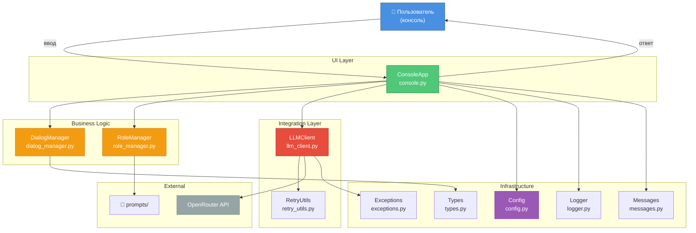
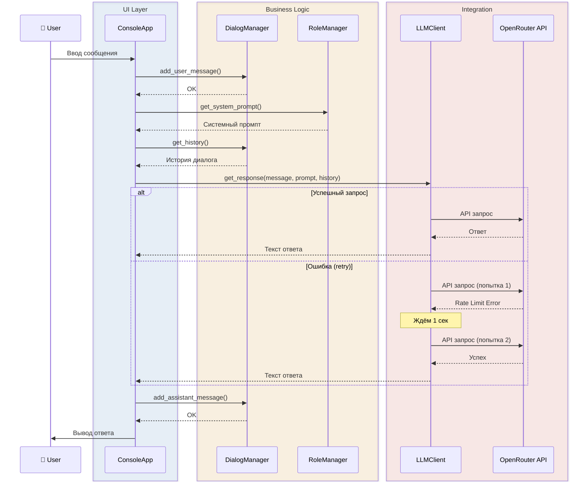
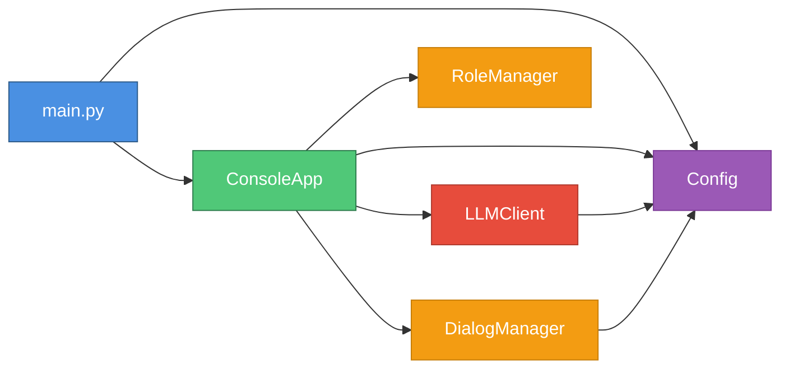
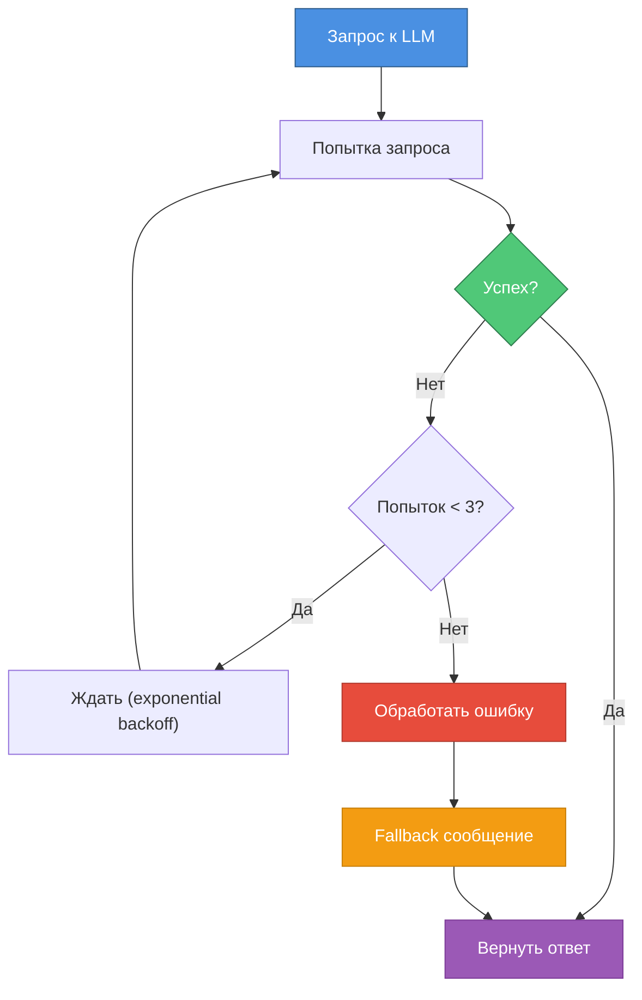
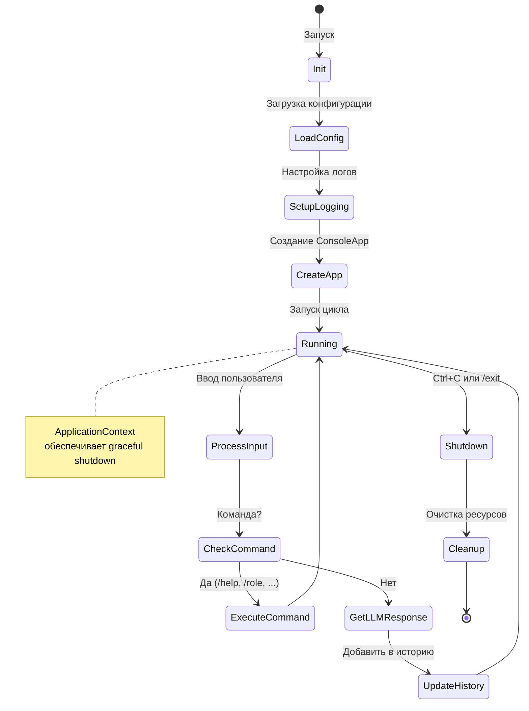

# 🏗️ Обзор архитектуры

> Понимание архитектуры проекта за 30 минут

## Архитектурные принципы

### KISS (Keep It Simple, Stupid)
- Минимальный MVP без оверинжиниринга
- Только необходимая функциональность
- Понятный код

### ООП: 1 класс = 1 файл
- Четкое разделение ответственности
- Понятные имена файлов
- Легко найти нужный код

### SOLID
- **Single Responsibility** — каждый класс делает одно дело
- **Dependency Inversion** — зависимость от абстракций (Protocol)
- **Open/Closed** — легко расширять без изменения существующего кода

---

## Общая структура



---

## Поток обработки запроса



---

## Слои архитектуры

### 1. UI Layer (Пользовательский интерфейс)

**`ConsoleApp` (console.py)**
- Обработка ввода пользователя
- Парсинг команд (`/help`, `/history`, `/role`, `/stats`, `/clear`, `/exit`)
- Вывод ответов
- Координация компонентов

---

### 2. Business Logic (Бизнес-логика)

**`DialogManager` (dialog_manager.py)**
- Хранение истории диалога в памяти
- Автоматическая обрезка (trimming) при превышении `max_history`
- Статистика диалога

**`RoleManager` (role_manager.py)**
- Загрузка системных промптов из файлов (`prompts/`)
- Парсинг метаданных (название, описание)
- Предоставление информации о роли

---

### 3. Integration Layer (Интеграции)

**`LLMClient` (llm_client.py)**
- Интеграция с OpenRouter API через OpenAI SDK
- Формирование запросов с историей
- Обработка ответов

**`RetryUtils` (retry_utils.py)**
- Декоратор `with_exponential_backoff`
- Экспоненциальный backoff (1s → 2s → 4s)
- Максимум 3 попытки

---

### 4. Infrastructure (Инфраструктура)

**`Config` (config.py)**
- Загрузка конфигурации из `.env` через Pydantic
- Валидация параметров
- Значения по умолчанию

**`Logger` (logger.py)**
- Структурированное логирование через `structlog`
- Цветной вывод для консоли
- Опциональная запись в файл

**`Exceptions` (exceptions.py)**
- Иерархия кастомных исключений:
  - `AppError` (базовый)
    - `ConfigError`
    - `LLMError` → `LLMRateLimitError`, `LLMConnectionError`, `LLMTimeoutError`, ...
    - `RetryError`

**`Messages` (messages.py)**
- Enum классы для сообщений (DRY принцип):
  - `ErrorMessages` — ошибки
  - `InfoMessages` — информационные сообщения
  - `FallbackMessages` — fallback ответы при ошибках LLM

**`Types` (types.py)**
- `Message` (TypedDict) — типизированное сообщение
- `MessageRole` (Literal) — роль в диалоге (`"user"` | `"assistant"` | `"system"`)

---

## Управление зависимостями



**Принцип:** Зависимости идут сверху вниз (от UI к Infrastructure), никаких циклических зависимостей.

---

## Обработка ошибок



---

## Асинхронность

Весь проект использует `async/await`:

- ✅ **Все I/O операции** — асинхронные
- ✅ **LLM запросы** — `await llm_client.get_response()`
- ✅ **Нет blocking операций** — используется `asyncio.sleep()` вместо `time.sleep()`

```python
# Пример: основной цикл приложения
async def run(self) -> None:
    while self.is_running:
        user_input = await asyncio.to_thread(input, "Вы: ")
        response = await self.get_response(user_input)
        print(f"Ассистент: {response}")
```

---

## Жизненный цикл приложения



---

## Точки расширения

### Как добавить новую команду

1. Добавить обработчик в `ConsoleApp.run()`
2. Добавить описание в `/help`
3. Написать тесты в `test_console.py`

### Как добавить нового LLM провайдера

1. Создать новый клиент (наследник `Protocol` для типизации)
2. Добавить параметры в `Config`
3. Обновить `LLMClient` или создать новый класс

### Как добавить новую роль

1. Создать файл в `prompts/my_role.txt`
2. Указать метаданные (`# Title:`, `# Description:`)
3. Установить `SYSTEM_PROMPT_FILE=prompts/my_role.txt` в `.env`

---

## Метрики качества

| Метрика | Значение | Статус |
|---------|----------|--------|
| **Test Coverage** | 87.59% | ✅ |
| **Tests Count** | 149 | ✅ |
| **Ruff Errors** | 0 | ✅ |
| **Mypy Errors** | 0 (strict mode) | ✅ |
| **Modules 100% coverage** | 6 из 11 | ✅ |

---

## 📚 Следующие шаги

- **[Тур по кодовой базе](03_codebase_tour.md)** — детальный обзор каждого модуля
- **[Модель данных](04_data_model.md)** — структуры данных и типизация
- **[Интеграции](05_integrations.md)** — работа с OpenRouter API

---

**⏱️ Время изучения:** 30 минут  
**🎯 Следующий гайд:** [Тур по кодовой базе →](03_codebase_tour.md)

