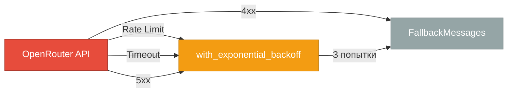
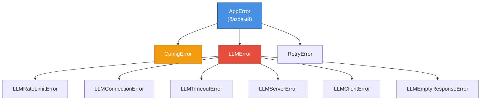
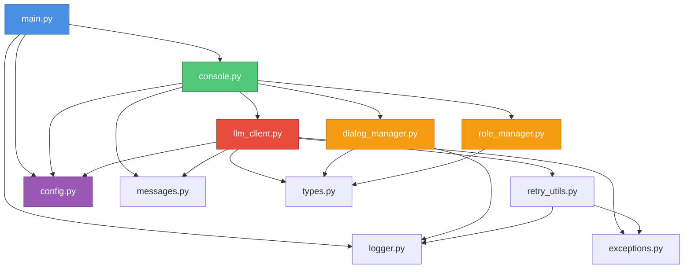

# 🗺️ Тур по кодовой базе

> Детальный обзор всех модулей за 45 минут

## Структура проекта

```
systech-aidd-main/
├── src/                    # Исходный код (11 модулей)
│   ├── main.py            # Точка входа
│   ├── console.py         # UI Layer
│   ├── dialog_manager.py  # Business Logic
│   ├── role_manager.py    # Business Logic
│   ├── llm_client.py      # Integration Layer
│   ├── retry_utils.py     # Integration Layer
│   ├── config.py          # Infrastructure
│   ├── logger.py          # Infrastructure
│   ├── exceptions.py      # Infrastructure
│   ├── messages.py        # Infrastructure
│   └── types.py           # Infrastructure
├── tests/                 # Тесты (149 тестов, 87.59% coverage)
├── prompts/               # Файлы ролей
├── docs/                  # Документация
└── Makefile              # Автоматизация
```

---

## UI Layer

### 📱 `console.py` — ConsoleApp (144 строки, 99% coverage)

**Назначение:** Консольный интерфейс приложения

**Ключевые методы:**

```python
class ConsoleApp:
    async def run(self) -> None:
        """Главный цикл приложения"""
        # Приветствие → Цикл ввода → Обработка → Вывод
    
    async def get_response(self, user_message: str) -> str:
        """Получить ответ от LLM"""
        # DialogManager → LLMClient → Обработка ошибок
    
    def _handle_command(self, command: str) -> bool:
        """Обработать команду (/help, /role, /stats, ...)"""
```

**Команды:**
- `/help` — справка
- `/history` — история диалога
- `/stats` — статистика
- `/role` — информация о роли
- `/clear` — очистить историю
- `/exit` — выход

**Зависимости:**
- `Config` — конфигурация
- `LLMClient` — запросы к LLM
- `DialogManager` — история диалога
- `RoleManager` — система ролей

**Точки расширения:**
- Добавление новой команды → метод `_handle_command()`
- Изменение приветствия → метод `display_welcome()`

---

## Business Logic

### 💬 `dialog_manager.py` — DialogManager (125 строк, 100% coverage)

**Назначение:** Управление историей диалога

**Ключевые методы:**

```python
class DialogManager:
    def __init__(self, max_history: int = 10):
        """max_history — количество пар (user + assistant)"""
        self.history: list[Message] = []
    
    def add_user_message(self, content: str) -> None:
        """Добавить сообщение пользователя"""
    
    def add_assistant_message(self, content: str) -> None:
        """Добавить ответ ассистента"""
    
    def get_history(self) -> list[Message]:
        """Получить копию истории"""
    
    def _trim_history(self) -> None:
        """Автоматическая обрезка при превышении лимита"""
```

**Как работает trimming:**
- `max_history=10` → максимум 20 сообщений (10 пар)
- При добавлении 21-го сообщения удаляются первые 2
- Сохраняется контекст последних N диалогов

**Точки расширения:**
- Добавить персистентность (сохранение в БД)
- Добавить поиск по истории

---

### 🎭 `role_manager.py` — RoleManager (164 строки, 100% coverage)

**Назначение:** Загрузка системных промптов из файлов

**Ключевые методы:**

```python
class RoleManager:
    def __init__(self, prompt_file: Path | None = None):
        """Загрузить промпт из файла"""
    
    def parse_metadata(self, content: str) -> RoleMetadata:
        """Парсинг метаданных (# Title:, # Description:)"""
    
    def get_role_info(self) -> RoleMetadata:
        """Получить информацию о роли"""
```

**Формат файла промпта:**

```
# Title: Technical Support Specialist
# Description: Provides technical support and troubleshooting help

You are a friendly technical support specialist...
```

**Точки расширения:**
- Динамическая смена роли без перезапуска
- Загрузка ролей из URL

---

## Integration Layer

### 🤖 `llm_client.py` — LLMClient (213 строк, 97% coverage)

**Назначение:** Интеграция с OpenRouter API

**Ключевые методы:**

```python
class LLMClient:
    MAX_RETRIES = 3
    INITIAL_RETRY_DELAY = 1.0  # секунды
    MAX_RETRY_DELAY = 10.0
    
    async def get_response(
        self,
        user_message: str,
        system_prompt: str,
        conversation_history: list[Message],
    ) -> str:
        """Получить ответ от LLM с retry логикой"""
    
    async def _make_api_call(
        self,
        messages: list[Message],
    ) -> str:
        """Внутренний метод для API запроса"""
```

**Обработка ошибок:**



**Точки расширения:**
- Добавить streaming ответов
- Поддержка других LLM провайдеров

---

### 🔄 `retry_utils.py` — RetryUtils (105 строк, 90% coverage)

**Назначение:** Retry логика с exponential backoff

**Главная функция:**

```python
async def with_exponential_backoff(
    operation: Callable[[], Awaitable[T]],
    *,
    max_retries: int = 3,
    initial_delay: float = 1.0,
    max_delay: float = 10.0,
    backoff_factor: float = 2.0,
) -> T:
    """
    Попытки: 1 → ждать 1s → 2 → ждать 2s → 3 → ждать 4s
    Максимум 3 попытки
    """
```

**Использование:**

```python
response = await with_exponential_backoff(
    lambda: self._make_api_call(messages),
    max_retries=3,
    operation_name="LLM API call",
    retryable_exceptions=(LLMRateLimitError, LLMTimeoutError),
)
```

---

## Infrastructure

### ⚙️ `config.py` — Config (16 строк, 94% coverage)

**Назначение:** Конфигурация через Pydantic

```python
from pydantic import Field
from pydantic_settings import BaseSettings

class Config(BaseSettings):
    # Обязательные параметры
    openrouter_api_key: str
    
    # LLM параметры
    system_prompt: str = "Ты полезный ассистент..."
    system_prompt_file: str = "prompts/default.txt"
    llm_model: str = "openai/gpt-3.5-turbo"
    llm_temperature: float = Field(default=0.7, ge=0.0, le=2.0)
    llm_max_tokens: int = Field(default=1000, ge=100, le=4000)
    max_history: int = Field(default=10, ge=1, le=50)
    
    # Логирование
    log_level: str = "INFO"
    log_to_file: bool = False
    log_file_path: str = "logs/app.log"
    log_colorful: bool = True
```

**Автоматическая загрузка:**
1. Переменные окружения (приоритет)
2. Файл `.env`
3. Значения по умолчанию

---

### 📝 `logger.py` — Logger (65 строк, 100% coverage)

**Назначение:** Структурированное логирование

```python
import structlog

def setup_logging(
    log_level: str = "INFO",
    console_output: bool = True,
    file_output: str | None = None,
    colorful: bool = True,
) -> None:
    """Настроить structlog"""

def get_logger(name: str) -> structlog.BoundLogger:
    """Получить logger для модуля"""
```

**Пример использования:**

```python
logger = get_logger("my_module")
logger.info("Событие", user_id=123, action="login")
logger.error("Ошибка", error=str(e), error_type=type(e).__name__)
```

**Вывод (цветной):**
```
2025-10-16 12:34:56 [info     ] Событие                user_id=123 action=login
2025-10-16 12:34:57 [error    ] Ошибка                 error=... error_type=ValueError
```

---

### 🚨 `exceptions.py` — Exceptions (24 строки, 100% coverage)

**Назначение:** Иерархия кастомных исключений



**Использование:**

```python
try:
    response = await api_call()
except RateLimitError as e:
    raise LLMRateLimitError("Rate limit exceeded") from e
```

---

### 💬 `messages.py` — Messages (51 строка, 100% coverage)

**Назначение:** Централизованные сообщения (DRY принцип)

```python
from enum import Enum

class ErrorMessages(Enum):
    """Сообщения об ошибках"""
    CONFIG_ERROR = "❌ Ошибка конфигурации..."
    LLM_ERROR = "⚠️  Не удалось получить ответ от LLM..."
    ...

class InfoMessages(Enum):
    """Информационные сообщения"""
    WELCOME = "╔═══════════════════════╗\n║  🤖 LLM-Ассистент  ║\n╚═══════════════════════╝"
    HELP_AVAILABLE = "Введите /help для справки"
    ...

class FallbackMessages(Enum):
    """Fallback ответы при ошибках LLM"""
    SHORT = "Извините, сейчас я не могу ответить."
    MEDIUM = "К сожалению, произошла ошибка..."
    ...
```

**Использование:**

```python
print(ErrorMessages.CONFIG_ERROR.value)
fallback = FallbackMessages.get_by_length(len(user_message))
```

---

### 📦 `types.py` — Types (18 строк, 100% coverage)

**Назначение:** Строгая типизация данных

```python
from typing import Literal, TypedDict

# Literal для роли
MessageRole = Literal["user", "assistant", "system"]

# TypedDict для сообщения
class Message(TypedDict):
    role: MessageRole
    content: str
```

**Преимущества:**

```python
# ❌ Плохо: dict[str, str]
message: dict[str, str] = {"role": "invalid", "content": "..."}  # Ошибка не ловится

# ✅ Хорошо: Message (TypedDict)
message: Message = {"role": "user", "content": "..."}  # Mypy проверит тип role
```

---

### 🚀 `main.py` — Entry Point (203 строки, 40% coverage)

**Назначение:** Точка входа, graceful shutdown

**Ключевые классы:**

```python
class ApplicationContext:
    """Управление жизненным циклом приложения"""
    
    def set_app(self, app: ConsoleApp) -> None:
        """Установить приложение в контекст"""
    
    def request_shutdown(self) -> None:
        """Запросить остановку (вызывается из signal handler)"""
    
    async def shutdown(self) -> None:
        """Остановить приложение асинхронно"""

async def main() -> int:
    """Главная функция"""
    # 1. Настроить логирование
    # 2. Загрузить Config
    # 3. Создать ConsoleApp
    # 4. Установить signal handlers (SIGINT, SIGTERM)
    # 5. Запустить app.run()
    # 6. Graceful shutdown при Ctrl+C
```

**Graceful Shutdown:**
- `Ctrl+C` → SIGINT → `ApplicationContext.request_shutdown()`
- Завершение текущего диалога
- Очистка ресурсов
- Корректный выход

---

## Карта зависимостей



**Правило:** Зависимости идут только сверху вниз (от UI к Infrastructure)

---

## Покрытие тестами

| Модуль | Coverage | Комментарий |
|--------|----------|-------------|
| `dialog_manager.py` | **100%** | ✅ Идеально |
| `exceptions.py` | **100%** | ✅ Идеально |
| `types.py` | **100%** | ✅ Идеально |
| `messages.py` | **100%** | ✅ Идеально |
| `logger.py` | **100%** | ✅ Идеально |
| `role_manager.py` | **100%** | ✅ Идеально |
| `console.py` | **99%** | ✅ Почти идеально |
| `llm_client.py` | **97%** | ✅ Почти идеально |
| `config.py` | **94%** | ✅ Отлично |
| `retry_utils.py` | **90%** | ✅ Отлично |
| `main.py` | **40%** | 🟡 Entry point (не критично) |

---

## Где искать что

### Хочу изменить UI
→ `console.py` (ConsoleApp)

### Хочу изменить историю диалога
→ `dialog_manager.py` (DialogManager)

### Хочу добавить новую роль
→ создать файл в `prompts/`

### Хочу изменить retry логику
→ `retry_utils.py` (with_exponential_backoff)

### Хочу добавить новое исключение
→ `exceptions.py` (наследовать от AppError)

### Хочу изменить сообщения
→ `messages.py` (Enum классы)

### Хочу добавить новый параметр конфигурации
→ `config.py` (добавить поле в Config)

### Хочу изменить логирование
→ `logger.py` (setup_logging)

---

## 📚 Следующие шаги

- **[Модель данных](04_data_model.md)** — структуры данных и типизация
- **[Интеграции](05_integrations.md)** — работа с OpenRouter API
- **[Конфигурация](06_configuration.md)** — настройка приложения

---

**⏱️ Время изучения:** 45 минут  
**🎯 Следующий гайд:** [Модель данных →](04_data_model.md)

