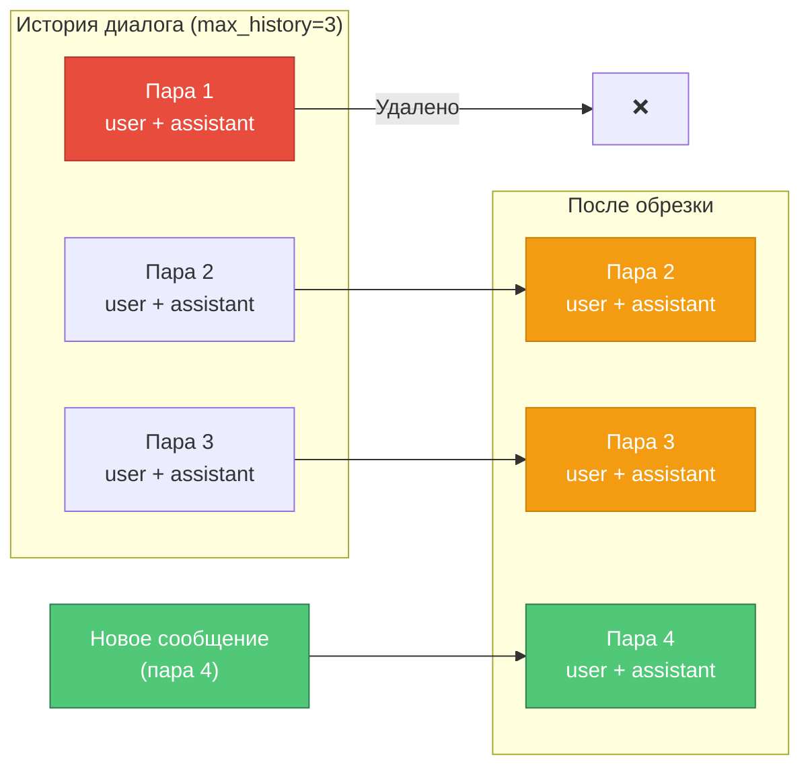

# 💾 Модель данных

> Структуры данных и типизация за 20 минут

## Основные структуры данных

### 1. Message (TypedDict)

Основная единица данных для сообщений в диалоге.

```python
from typing import Literal, TypedDict

# Literal тип для ограничения значений роли
MessageRole = Literal["user", "assistant", "system"]

class Message(TypedDict):
    """Типизированное сообщение в диалоге."""
    role: MessageRole
    content: str
```

**Примеры использования:**

```python
# ✅ Валидное сообщение
user_msg: Message = {
    "role": "user",
    "content": "Привет, как дела?"
}

# ✅ Валидное сообщение ассистента
assistant_msg: Message = {
    "role": "assistant",
    "content": "Привет! Всё отлично, спасибо!"
}

# ❌ Mypy поймает ошибку
invalid_msg: Message = {
    "role": "invalid_role",  # Ошибка: "invalid_role" не в Literal["user", "assistant", "system"]
    "content": "..."
}
```

---

### 2. RoleMetadata (TypedDict)

Метаданные для системы ролей.

```python
class RoleMetadata(TypedDict):
    """Метаданные роли.
    
    Attributes:
        title: Название роли
        description: Описание роли
        source: Источник роли (путь к файлу или "default")
    """
    title: str
    description: str
    source: str
```

**Пример:**

```python
role_info: RoleMetadata = {
    "title": "Technical Support Specialist",
    "description": "Provides technical support and troubleshooting help",
    "source": "prompts/tech_support.txt"
}
```

---

### 3. Config (Pydantic модель)

Конфигурация приложения с валидацией.

```python
from pydantic import Field
from pydantic_settings import BaseSettings

class Config(BaseSettings):
    # Обязательные параметры
    openrouter_api_key: str
    
    # LLM параметры (с валидацией диапазона)
    llm_temperature: float = Field(default=0.7, ge=0.0, le=2.0)
    llm_max_tokens: int = Field(default=1000, ge=100, le=4000)
    max_history: int = Field(default=10, ge=1, le=50)
    
    # Строковые параметры
    system_prompt: str = "Ты полезный ассистент..."
    system_prompt_file: str = "prompts/default.txt"
    llm_model: str = "openai/gpt-3.5-turbo"
    
    # Логирование
    log_level: str = "INFO"
    log_to_file: bool = False
    log_file_path: str = "logs/app.log"
    log_colorful: bool = True
```

**Преимущества Pydantic:**
- Автоматическая валидация типов
- Валидация диапазонов значений (`ge`, `le`)
- Автоматическая загрузка из `.env`
- Понятные сообщения об ошибках

---

## История диалога

### Структура хранения

История диалога хранится как список сообщений:

```python
class DialogManager:
    def __init__(self, max_history: int = 10):
        self.history: list[Message] = []
        self.max_history = max_history  # Количество ПАР (user + assistant)
```

**Пример истории:**

```python
history = [
    {"role": "user", "content": "Привет!"},
    {"role": "assistant", "content": "Здравствуйте!"},
    {"role": "user", "content": "Как дела?"},
    {"role": "assistant", "content": "Отлично, спасибо!"},
]
```

---

### Trimming (обрезка истории)



**Логика обрезки:**

```python
def _trim_history(self) -> None:
    """Обрезать историю до максимальной длины."""
    max_messages = self.max_history * 2  # Пары: user + assistant
    
    if len(self.history) > max_messages:
        # Оставляем только последние max_messages сообщений
        self.history = self.history[-max_messages:]
```

**Примеры:**

| max_history | Макс. сообщений | Описание |
|-------------|----------------|----------|
| 5 | 10 | 5 пар вопрос-ответ |
| 10 | 20 | 10 пар (по умолчанию) |
| 20 | 40 | 20 пар (длинный контекст) |

---

## Система типизации

### Почему TypedDict, а не dict?

**❌ Без типизации:**

```python
message = {"role": "usr", "content": "Hi"}  # Опечатка в "user" не ловится
history: list[dict] = [message]  # Нет проверки структуры
```

**✅ С TypedDict:**

```python
message: Message = {"role": "user", "content": "Hi"}
history: list[Message] = [message]

# Mypy проверит:
# 1. Наличие обязательных полей (role, content)
# 2. Типы полей (MessageRole, str)
# 3. Нет лишних полей
```

---

### Почему Literal для роли?

**❌ Без Literal:**

```python
role: str = "moderator"  # Mypy не поймает ошибку
```

**✅ С Literal:**

```python
role: MessageRole = "moderator"  # ❌ Mypy ошибка: "moderator" не в Literal["user", "assistant", "system"]
role: MessageRole = "user"       # ✅ OK
```

---

## Работа с данными

### Добавление сообщений

```python
# DialogManager
manager = DialogManager(max_history=10)

# Добавить сообщение пользователя
manager.add_user_message("Привет!")

# Добавить ответ ассистента
manager.add_assistant_message("Здравствуйте!")

# Или напрямую
manager.add_message("system", "Ты полезный ассистент")
```

---

### Получение истории

```python
# Получить копию истории
history: list[Message] = manager.get_history()

# Безопасно: изменения в history не влияют на manager.history
history.append({"role": "user", "content": "..."})  # OK, это копия
```

---

### Статистика диалога

```python
stats = manager.get_conversation_summary()
# {
#     "total_messages": 4,
#     "user_messages": 2,
#     "assistant_messages": 2,
#     "max_history": 10
# }

# Или через len()
count = len(manager)  # 4
```

---

## Валидация данных

### Пустые сообщения

```python
manager.add_user_message("")        # Игнорируется (warning в логах)
manager.add_user_message("   ")    # Игнорируется (только пробелы)
manager.add_user_message("Hello")  # ✅ Добавляется
```

---

### Валидация конфигурации

```python
# ❌ Некорректные значения
config = Config(
    openrouter_api_key="...",
    llm_temperature=3.0,  # ValidationError: должно быть <= 2.0
    max_history=0,        # ValidationError: должно быть >= 1
)

# ✅ Валидные значения
config = Config(
    openrouter_api_key="sk-or-v1-...",
    llm_temperature=0.7,  # OK: в диапазоне [0.0, 2.0]
    max_history=10,       # OK: в диапазоне [1, 50]
)
```

---

## Сериализация и десериализация

### История диалога → JSON (для логов)

```python
import json

history = manager.get_history()
json_str = json.dumps(history, ensure_ascii=False, indent=2)
```

**Результат:**

```json
[
  {
    "role": "user",
    "content": "Привет!"
  },
  {
    "role": "assistant",
    "content": "Здравствуйте!"
  }
]
```

---

### JSON → История диалога

```python
import json

json_str = '[{"role": "user", "content": "Hi"}]'
messages: list[Message] = json.loads(json_str)

# Добавить в историю
for msg in messages:
    manager.add_message(msg["role"], msg["content"])
```

---

## Расширение модели данных

### Как добавить новое поле в Message

1. Обновить `Message` в `types.py`:

```python
class Message(TypedDict):
    role: MessageRole
    content: str
    timestamp: float  # Новое поле
```

2. Обновить `DialogManager.add_message()`:

```python
import time

def add_message(self, role: MessageRole, content: str) -> None:
    self.history.append({
        "role": role,
        "content": content,
        "timestamp": time.time()  # Добавить timestamp
    })
```

3. Написать тесты:

```python
def test_message_with_timestamp():
    manager = DialogManager()
    before = time.time()
    manager.add_user_message("Test")
    after = time.time()
    
    msg = manager.get_history()[0]
    assert "timestamp" in msg
    assert before <= msg["timestamp"] <= after
```

---

## Best Practices

### ✅ Используй TypedDict

```python
# ✅ Хорошо: явная типизация
def process_message(msg: Message) -> str:
    return f"{msg['role']}: {msg['content']}"

# ❌ Плохо: dict без типизации
def process_message(msg: dict) -> str:
    return f"{msg['role']}: {msg['content']}"  # Нет проверки структуры
```

---

### ✅ Используй Literal для constrained values

```python
# ✅ Хорошо: Literal ограничивает значения
LogLevel = Literal["DEBUG", "INFO", "WARNING", "ERROR"]

def set_log_level(level: LogLevel) -> None:
    ...

# ❌ Плохо: str без ограничений
def set_log_level(level: str) -> None:
    ...
```

---

### ✅ Используй Pydantic для конфигурации

```python
# ✅ Хорошо: Pydantic с валидацией
class Config(BaseSettings):
    temperature: float = Field(ge=0.0, le=2.0)

# ❌ Плохо: dict с ручной валидацией
config = {"temperature": 0.7}
if not (0.0 <= config["temperature"] <= 2.0):
    raise ValueError("...")
```

---

### ✅ Копируй историю при возврате

```python
# ✅ Хорошо: возвращаем копию
def get_history(self) -> list[Message]:
    return self.history.copy()

# ❌ Плохо: возвращаем оригинал (можно изменить извне)
def get_history(self) -> list[Message]:
    return self.history
```

---

## 📚 Следующие шаги

- **[Интеграции](05_integrations.md)** — работа с OpenRouter API
- **[Конфигурация](06_configuration.md)** — настройка через `.env`
- **[Тестирование](08_testing_and_quality.md)** — как тестировать модель данных

---

**⏱️ Время изучения:** 20 минут  
**🎯 Следующий гайд:** [Интеграции →](05_integrations.md)

