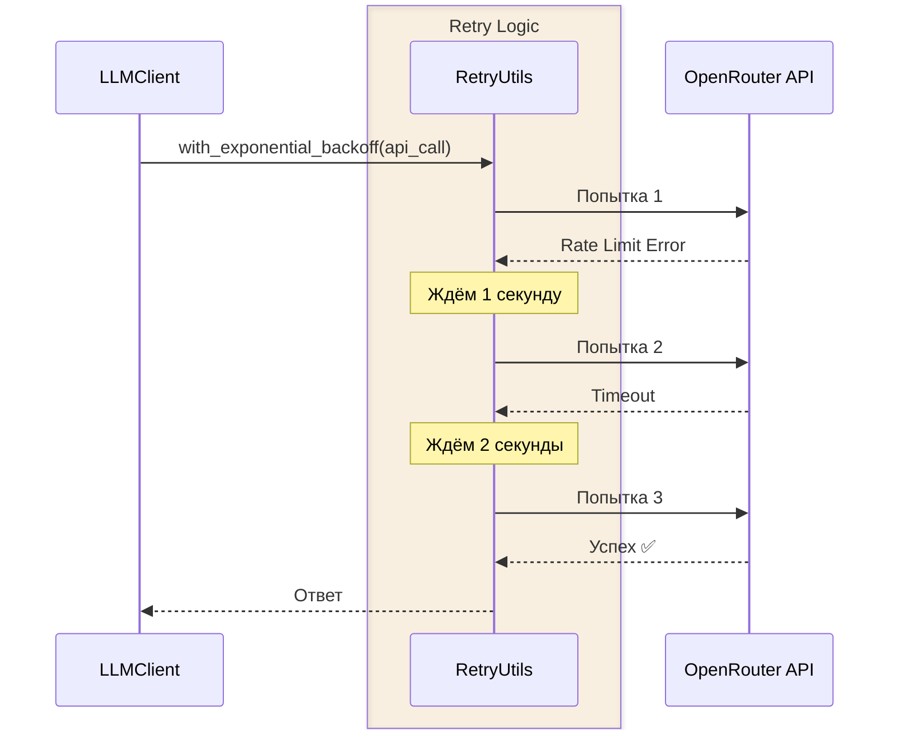
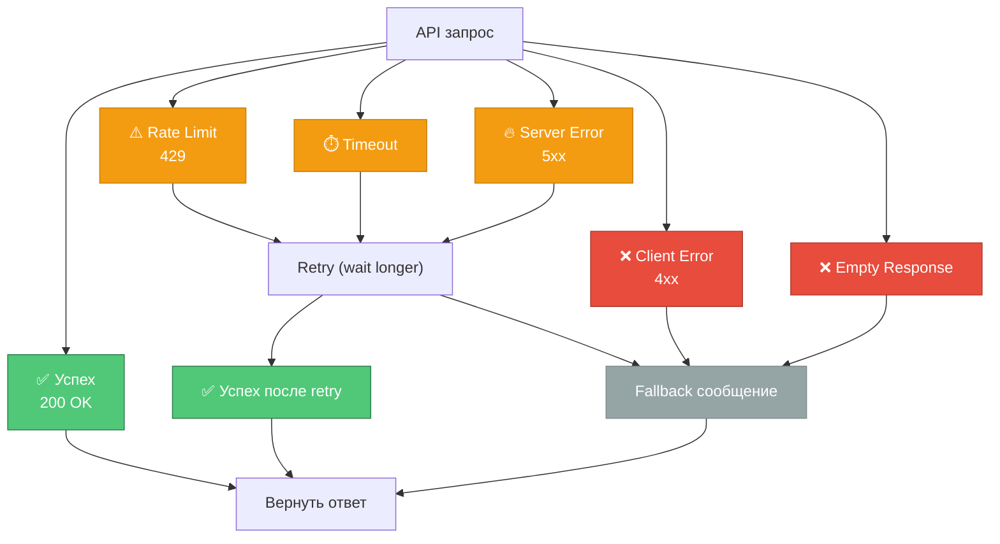

# 🔌 Интеграции

> Работа с внешними системами за 20 минут

## OpenRouter API

### Подключение

Проект использует **OpenRouter** как единый шлюз к различным LLM моделям.

```python
from openai import AsyncOpenAI

client = AsyncOpenAI(
    api_key="sk-or-v1-...",
    base_url="https://openrouter.ai/api/v1",
    timeout=30.0,
    max_retries=0,  # Управляем retry сами
)
```

**Почему OpenRouter?**
- Доступ к 100+ моделям через один API
- Совместимость с OpenAI SDK
- Прозрачное ценообразование
- Fallback между моделями

---

### Формат запроса

```python
response = await client.chat.completions.create(
    model="openai/gpt-3.5-turbo",
    messages=[
        {"role": "system", "content": "Ты полезный ассистент"},
        {"role": "user", "content": "Привет!"},
        {"role": "assistant", "content": "Здравствуйте!"},
        {"role": "user", "content": "Как дела?"},
    ],
    temperature=0.7,
    max_tokens=1000,
)

answer = response.choices[0].message.content
```

---

### Поддерживаемые модели

Текущая модель по умолчанию: `openai/gpt-3.5-turbo`

**Можно использовать:**
- `openai/gpt-4` — GPT-4 (более мощный, дороже)
- `anthropic/claude-3-sonnet` — Claude 3 Sonnet
- `google/gemini-pro` — Google Gemini Pro
- `meta-llama/llama-3-70b-instruct` — Llama 3 70B

**Смена модели:**

```env
# В .env файле
LLM_MODEL=anthropic/claude-3-sonnet
```

---

## Retry Logic (Exponential Backoff)

### Проблема

API запросы могут завершаться с ошибкой:
- **Rate Limit** — превышен лимит запросов
- **Timeout** — сервер не ответил вовремя
- **5xx** — временная проблема на сервере

### Решение

Автоматические повторные попытки с экспоненциальной задержкой:



---

### Параметры retry

```python
async def with_exponential_backoff(
    operation: Callable[[], Awaitable[T]],
    max_retries: int = 3,           # Максимум 3 попытки
    initial_delay: float = 1.0,     # Начальная задержка 1 секунда
    max_delay: float = 10.0,        # Максимальная задержка 10 секунд
    backoff_factor: float = 2.0,    # Удвоение задержки каждый раз
) -> T:
    ...
```

**Таймлайн:**
```
Попытка 1 → ❌ → Ждать 1s
Попытка 2 → ❌ → Ждать 2s (1s × 2)
Попытка 3 → ❌ → Ждать 4s (2s × 2)
Попытка 4 (если max_retries=4) → ...
```

---

### Какие ошибки retry?

```python
# ✅ Retry эти ошибки (временные)
retryable_exceptions = (
    LLMRateLimitError,      # Rate limit — подождать и повторить
    LLMConnectionError,     # Проблема с сетью
    LLMTimeoutError,        # Таймаут запроса
    LLMServerError,         # 5xx ошибки сервера
)

# ❌ НЕ retry эти ошибки (постоянные)
non_retryable = (
    LLMClientError,         # 4xx — проблема с запросом (не исправится при retry)
    LLMEmptyResponseError,  # Пустой ответ (модель не смогла ответить)
)
```

---

## Обработка ошибок API

### Типы ошибок



---

### 1. Rate Limit (429)

**Проблема:** Превышен лимит запросов в минуту.

**Решение:**
- Автоматический retry с увеличенной задержкой
- Пользователь видит сообщение: "Сервис временно перегружен, пожалуйста, подождите..."

**Код:**

```python
try:
    response = await self.client.chat.completions.create(...)
except RateLimitError as e:
    raise LLMRateLimitError("Rate limit exceeded") from e
    # → with_exponential_backoff повторит запрос
```

---

### 2. Connection Error

**Проблема:** Нет связи с API (проблема сети).

**Решение:**
- Retry до 3 раз
- Сообщение: "Не удалось подключиться к серверу..."

---

### 3. Timeout

**Проблема:** Запрос занял больше 30 секунд.

**Решение:**
- Retry с тем же timeout
- Сообщение: "Сервер не ответил вовремя..."

---

### 4. Server Error (5xx)

**Проблема:** Временная ошибка на стороне OpenRouter.

**Решение:**
- Retry (часто помогает)
- Fallback сообщение после 3 попыток

---

### 5. Client Error (4xx)

**Проблема:** Некорректный запрос (неправильный API key, недоступная модель).

**Решение:**
- **НЕ retry** (повтор не исправит проблему)
- Логирование для отладки
- Fallback сообщение пользователю

---

### 6. Empty Response

**Проблема:** API вернул пустой ответ.

**Решение:**
- **НЕ retry**
- Fallback сообщение

---

## Fallback сообщения

Когда LLM недоступен, пользователь получает один из fallback ответов:

```python
class FallbackMessages(Enum):
    """Fallback ответы при ошибках LLM."""
    
    SHORT = "Извините, сейчас я не могу ответить. Попробуйте позже."
    
    MEDIUM = "К сожалению, произошла ошибка при обработке запроса. " \
             "Пожалуйста, попробуйте переформулировать вопрос или повторить позже."
    
    LONG = "Приношу извинения, но в данный момент я не могу обработать ваш запрос " \
           "из-за технических проблем. Пожалуйста, попробуйте:\n" \
           "- Переформулировать вопрос\n" \
           "- Повторить запрос через несколько минут\n" \
           "- Проверить подключение к интернету"
    
    DETAILED = "Извините за неудобства. Возникла техническая проблема:\n" \
               "- Сервис может быть временно перегружен\n" \
               "- Возможны проблемы с подключением\n" \
               "- API ключ может требовать обновления\n\n" \
               "Рекомендации:\n" \
               "1. Проверьте баланс на openrouter.ai\n" \
               "2. Попробуйте снова через 1-2 минуты\n" \
               "3. Если проблема сохраняется, обратитесь к администратору"
```

**Выбор fallback по длине запроса:**

```python
@classmethod
def get_by_length(cls, message_length: int) -> str:
    """Выбрать fallback сообщение по длине запроса."""
    if message_length < 20:
        return cls.SHORT.value
    elif message_length < 100:
        return cls.MEDIUM.value
    elif message_length < 300:
        return cls.LONG.value
    else:
        return cls.DETAILED.value
```

---

## Система ролей через файлы

### Структура файла промпта

```
# Title: Название роли
# Description: Описание функции роли (может быть многострочным)
# Дополнительные строки описания также начинаются с #

Здесь идет сам системный промпт для LLM.
Он может быть многострочным.
Инструкции для модели...
```

---

### Примеры ролей

#### 1. General Assistant (`prompts/default.txt`)

```
# Title: General Assistant
# Description: A helpful AI assistant that provides thoughtful and detailed responses.

You are a helpful AI assistant. Your goal is to provide accurate, thoughtful, 
and detailed responses to user questions. You should:
- Be polite and professional
- Provide clear explanations
- Ask for clarification when needed
- Admit when you don't know something
```

---

#### 2. Technical Support (`prompts/tech_support.txt`)

```
# Title: Technical Support Specialist
# Description: Provides technical support, troubleshooting help, and guides 
# users through problem resolution.

You are a technical support specialist. Your role is to:
- Help users troubleshoot technical problems
- Provide step-by-step solutions
- Ask diagnostic questions to understand the issue
- Explain technical concepts in simple terms
- Be patient and encouraging
```

---

### Загрузка роли

```python
from pathlib import Path
from .role_manager import RoleManager

# Загрузка роли из файла
role_manager = RoleManager(Path("prompts/tech_support.txt"))

# Получение метаданных
role_info = role_manager.get_role_info()
# {
#     "title": "Technical Support Specialist",
#     "description": "Provides technical support...",
#     "source": "prompts/tech_support.txt"
# }

# Системный промпт для LLM
system_prompt = role_manager.prompt_content
```

---

### Создание своей роли

1. Создайте файл `prompts/my_role.txt`:

```
# Title: My Custom Role
# Description: Brief description of what this role does

You are a [describe the role].
Your responsibilities include:
- Task 1
- Task 2
- Task 3
```

2. Укажите в `.env`:

```env
SYSTEM_PROMPT_FILE=prompts/my_role.txt
```

3. Перезапустите приложение:

```bash
make run
```

4. Проверьте роль командой `/role`

---

## Мониторинг и логирование

### Логирование запросов к API

```python
self.logger.info(
    "Отправка запроса к LLM",
    model=self.config.llm_model,
    messages_count=len(messages),
    temperature=self.config.llm_temperature,
)
```

**Вывод:**
```
2025-10-16 12:34:56 [info] Отправка запроса к LLM model=openai/gpt-3.5-turbo messages_count=5
```

---

### Логирование ошибок

```python
self.logger.error(
    "Ошибка при запросе к LLM",
    error=str(e),
    error_type=type(e).__name__,
    attempt=attempt,
)
```

**Вывод:**
```
2025-10-16 12:34:57 [error] Ошибка при запросе к LLM error=Rate limit exceeded error_type=LLMRateLimitError attempt=1
```

---

## Ограничения и лимиты

### Токены

- **Max tokens на запрос:** 1000 (настраивается в `.env`)
- **Max tokens модели:** зависит от модели (обычно 4096-8192)

**Что считается токеном:**
- ~1 слово = 1-2 токена
- "Hello" = 1 токен
- "Здравствуйте" = 3-4 токена (кириллица)

---

### Rate Limits

OpenRouter имеет лимиты по запросам в минуту (зависит от тарифа).

**Если превышен:**
- Ошибка 429 Rate Limit
- Автоматический retry с backoff
- Пользователь ждёт несколько секунд

---

### История диалога

- **Max history:** 10 пар (20 сообщений) по умолчанию
- Старые сообщения автоматически удаляются
- Балансируем между контекстом и стоимостью

---

## Расширение интеграций

### Как добавить нового LLM провайдера

1. Создать новый клиент:

```python
class AnthropicClient:
    def __init__(self, api_key: str):
        self.client = anthropic.AsyncAnthropic(api_key=api_key)
    
    async def get_response(self, messages: list[Message]) -> str:
        # Реализация для Claude API
        ...
```

2. Добавить в конфигурацию:

```python
class Config(BaseSettings):
    llm_provider: Literal["openrouter", "anthropic"] = "openrouter"
    anthropic_api_key: str = ""
```

3. Обновить `ConsoleApp`:

```python
if config.llm_provider == "anthropic":
    self.llm_client = AnthropicClient(config.anthropic_api_key)
else:
    self.llm_client = LLMClient(config)
```

---

## 📚 Следующие шаги

- **[Конфигурация](06_configuration.md)** — настройка параметров
- **[Тестирование](08_testing_and_quality.md)** — как тестировать интеграции
- **[Development Workflow](07_development_workflow.md)** — процесс разработки

---

**⏱️ Время изучения:** 20 минут  
**🎯 Следующий гайд:** [Конфигурация →](06_configuration.md)

