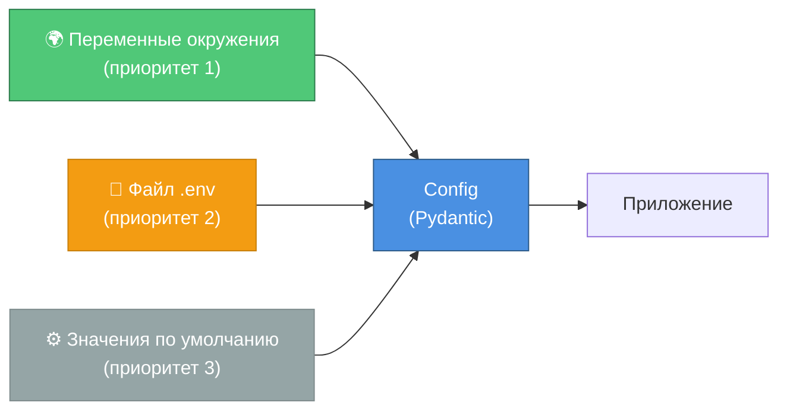
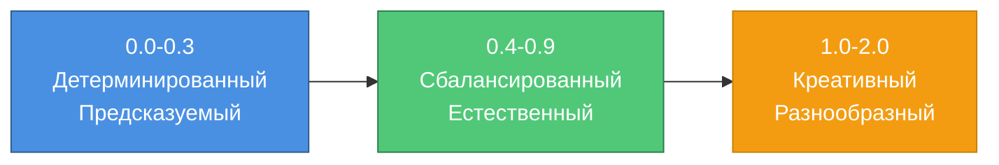

# ⚙️ Конфигурация

> Управление настройками приложения за 15 минут

## Источники конфигурации



**Приоритет:**
1. Переменные окружения (устанавливаются в системе)
2. Файл `.env` (локальные настройки)
3. Значения по умолчанию (в `config.py`)

---

## Структура файла .env

Создайте файл `.env` в корне проекта:

```env
# ═══════════════════════════════════════════════════════
# OpenRouter API Configuration
# ═══════════════════════════════════════════════════════

# Обязательный параметр! Получить на https://openrouter.ai
OPENROUTER_API_KEY=sk-or-v1-your-api-key-here

# ═══════════════════════════════════════════════════════
# LLM Configuration
# ═══════════════════════════════════════════════════════

# Системный промпт (используется, если не указан файл)
SYSTEM_PROMPT=Ты полезный ассистент. Отвечай дружелюбно и информативно.

# Путь к файлу с системным промптом (приоритет над SYSTEM_PROMPT)
SYSTEM_PROMPT_FILE=prompts/default.txt

# Максимальное количество пар (user + assistant) в истории
# Диапазон: 1-50, по умолчанию: 10
MAX_HISTORY=10

# Модель LLM (доступные модели на openrouter.ai/models)
LLM_MODEL=openai/gpt-3.5-turbo

# Температура (креативность ответов)
# 0.0 = детерминированный, 2.0 = очень креативный
# Диапазон: 0.0-2.0, по умолчанию: 0.7
LLM_TEMPERATURE=0.7

# Максимальное количество токенов в ответе
# Диапазон: 100-4000, по умолчанию: 1000
LLM_MAX_TOKENS=1000

# ═══════════════════════════════════════════════════════
# Logging Configuration
# ═══════════════════════════════════════════════════════

# Уровень логирования: DEBUG, INFO, WARNING, ERROR, CRITICAL
LOG_LEVEL=INFO

# Логирование в файл (true/false)
LOG_TO_FILE=false

# Путь к файлу логов (если LOG_TO_FILE=true)
LOG_FILE_PATH=logs/app.log

# Цветной вывод логов в консоли (true/false)
LOG_COLORFUL=true
```

---

## Параметры конфигурации

### 🔑 Обязательные параметры

#### `OPENROUTER_API_KEY`

**Описание:** API ключ для OpenRouter  
**Тип:** `str`  
**Обязателен:** ✅ Да  
**Получить:** [openrouter.ai/keys](https://openrouter.ai/keys)

**Пример:**
```env
OPENROUTER_API_KEY=sk-or-v1-1234567890abcdef...
```

---

### 🤖 LLM параметры

#### `SYSTEM_PROMPT`

**Описание:** Системный промпт для LLM (используется, если не указан файл)  
**Тип:** `str`  
**По умолчанию:** `"Ты полезный ассистент..."`

**Пример:**
```env
SYSTEM_PROMPT=Ты опытный программист на Python. Помогай с кодом и отладкой.
```

---

#### `SYSTEM_PROMPT_FILE`

**Описание:** Путь к файлу с системным промптом (приоритет над `SYSTEM_PROMPT`)  
**Тип:** `str | None`  
**По умолчанию:** `None`  
**Валидация:** Файл должен существовать

**Пример:**
```env
SYSTEM_PROMPT_FILE=prompts/tech_support.txt
```

**Формат файла:**
```
# Title: Technical Support
# Description: Helps users with technical issues

You are a technical support specialist...
```

---

#### `MAX_HISTORY`

**Описание:** Максимальное количество пар (user + assistant) в истории  
**Тип:** `int`  
**Диапазон:** 1-50  
**По умолчанию:** 10

**Примеры:**

| Значение | Макс. сообщений | Когда использовать |
|----------|----------------|-------------------|
| 5 | 10 | Короткие диалоги, экономия токенов |
| 10 | 20 | Сбалансированный вариант (по умолчанию) |
| 20 | 40 | Длинные диалоги с контекстом |

---

#### `LLM_MODEL`

**Описание:** Модель LLM для генерации ответов  
**Тип:** `str`  
**По умолчанию:** `"openai/gpt-3.5-turbo"`

**Популярные модели:**

| Модель | Описание | Цена (примерная) |
|--------|----------|------------------|
| `openai/gpt-3.5-turbo` | Быстрый, недорогой | $ |
| `openai/gpt-4` | Более мощный | $$$ |
| `anthropic/claude-3-sonnet` | Claude 3 | $$ |
| `google/gemini-pro` | Google Gemini | $$ |

**Полный список:** [openrouter.ai/models](https://openrouter.ai/models)

---

#### `LLM_TEMPERATURE`

**Описание:** Температура (креативность ответов)  
**Тип:** `float`  
**Диапазон:** 0.0-2.0  
**По умолчанию:** 0.7

**Влияние на ответы:**



**Рекомендации:**
- **0.0-0.3** — Факты, техническая документация
- **0.7** — Общие диалоги (по умолчанию)
- **1.0-1.5** — Креативное письмо, идеи

---

#### `LLM_MAX_TOKENS`

**Описание:** Максимальное количество токенов в ответе  
**Тип:** `int`  
**Диапазон:** 100-4000  
**По умолчанию:** 1000

**Ориентиры:**
- 100 токенов ≈ 75 слов (короткий ответ)
- 500 токенов ≈ 375 слов (средний ответ)
- 1000 токенов ≈ 750 слов (подробный ответ)
- 2000 токенов ≈ 1500 слов (очень подробный)

---

### 📝 Параметры логирования

#### `LOG_LEVEL`

**Описание:** Уровень логирования  
**Тип:** `str`  
**Возможные значения:** `DEBUG`, `INFO`, `WARNING`, `ERROR`, `CRITICAL`  
**По умолчанию:** `INFO`

**Уровни:**

| Уровень | Что логируется | Когда использовать |
|---------|----------------|-------------------|
| `DEBUG` | Всё (включая детали) | Отладка |
| `INFO` | Основные события | Production (по умолчанию) |
| `WARNING` | Предупреждения | Production |
| `ERROR` | Только ошибки | Минималистичный лог |

---

#### `LOG_TO_FILE`

**Описание:** Включить логирование в файл  
**Тип:** `bool`  
**По умолчанию:** `false`

**Пример:**
```env
LOG_TO_FILE=true
```

---

#### `LOG_FILE_PATH`

**Описание:** Путь к файлу логов  
**Тип:** `str`  
**По умолчанию:** `logs/app.log`

**Пример:**
```env
LOG_FILE_PATH=logs/app.log
```

**Директория создается автоматически.**

---

#### `LOG_COLORFUL`

**Описание:** Цветной вывод логов в консоли  
**Тип:** `bool`  
**По умолчанию:** `true`

**Пример:**
```env
LOG_COLORFUL=true   # Цветной вывод (удобно для разработки)
LOG_COLORFUL=false  # Без цветов (для production логов)
```

---

## Валидация конфигурации

### Автоматическая валидация через Pydantic

```python
class Config(BaseSettings):
    # Валидация диапазона
    llm_temperature: float = Field(default=0.7, ge=0.0, le=2.0)
    #                                               ↑     ↑
    #                                            min   max
    
    # Валидация существования файла
    @field_validator("system_prompt_file")
    def validate_prompt_file(cls, v: str | None) -> str | None:
        if v is not None and not Path(v).exists():
            raise ValueError(f"Prompt file not found: {v}")
        return v
```

---

### Примеры ошибок валидации

**❌ Температура вне диапазона:**
```env
LLM_TEMPERATURE=3.0  # > 2.0
```

**Ошибка:**
```
ValidationError: llm_temperature: Input should be less than or equal to 2.0
```

---

**❌ Файл промпта не существует:**
```env
SYSTEM_PROMPT_FILE=prompts/nonexistent.txt
```

**Ошибка:**
```
ValueError: Prompt file not found: prompts/nonexistent.txt
```

---

**❌ API ключ не указан:**
```env
# OPENROUTER_API_KEY не установлен
```

**Ошибка:**
```
ValidationError: openrouter_api_key: Field required
```

---

## Конфигурация для разных окружений

### Development (разработка)

```env
# .env.development
OPENROUTER_API_KEY=sk-or-v1-dev-key
LOG_LEVEL=DEBUG
LOG_TO_FILE=true
LOG_COLORFUL=true
MAX_HISTORY=5  # Экономия токенов при тестировании
```

---

### Production (продакшн)

```env
# .env.production
OPENROUTER_API_KEY=sk-or-v1-prod-key
LOG_LEVEL=INFO
LOG_TO_FILE=true
LOG_COLORFUL=false  # Без цветов для логов
MAX_HISTORY=10
LLM_TEMPERATURE=0.7
```

---

### Testing (тестирование)

```env
# .env.test
OPENROUTER_API_KEY=sk-or-v1-test-key
LOG_LEVEL=ERROR  # Минимум логов в тестах
LOG_TO_FILE=false
MAX_HISTORY=2  # Минимум для быстрых тестов
```

---

## Секреты и безопасность

### ✅ Правильное хранение секретов

```env
# ✅ В .env файле (не коммитится в git)
OPENROUTER_API_KEY=sk-or-v1-secret-key
```

**.gitignore:**
```
.env          # ← Добавлен в .gitignore
.env.local
.env.*.local
```

---

### ❌ Неправильное хранение секретов

```python
# ❌ Хардкод в коде
OPENROUTER_API_KEY = "sk-or-v1-secret-key"

# ❌ Коммит .env в git
git add .env  # НЕ ДЕЛАЙТЕ ТАК!
```

---

### Переменные окружения в системе

**Windows (PowerShell):**
```powershell
$env:OPENROUTER_API_KEY="sk-or-v1-..."
```

**Linux/macOS:**
```bash
export OPENROUTER_API_KEY="sk-or-v1-..."
```

**Приоритет:** переменные окружения > `.env` файл

---

## Проверка конфигурации

### Вывод текущей конфигурации

```python
from src.config import Config

config = Config()
print(config)
```

**Вывод (без секретов):**
```
Config(
    system_prompt='Ты полезный ассистент...', 
    max_history=10, 
    llm_model='openai/gpt-3.5-turbo', 
    llm_temperature=0.7, 
    llm_max_tokens=1000, 
    log_level='INFO', 
    log_to_file=False
)
```

---

### Тестирование конфигурации

```bash
# Запустить приложение с тестовой конфигурацией
make run

# Если конфигурация некорректна, приложение не запустится с понятной ошибкой
```

---

## Частые вопросы

### В: Где взять API ключ?

**О:** Зарегистрируйтесь на [openrouter.ai](https://openrouter.ai), пополните баланс ($5 достаточно), скопируйте ключ из раздела "API Keys".

---

### В: Как сменить модель?

**О:** Измените `LLM_MODEL` в `.env`:
```env
LLM_MODEL=anthropic/claude-3-sonnet
```

---

### В: Как использовать свой промпт?

**О:** Два способа:

1. **Через строку:**
```env
SYSTEM_PROMPT=Твой кастомный промпт здесь
```

2. **Через файл (рекомендуется):**
```env
SYSTEM_PROMPT_FILE=prompts/my_role.txt
```

---

### В: Как увеличить длину ответов?

**О:** Увеличьте `LLM_MAX_TOKENS`:
```env
LLM_MAX_TOKENS=2000  # Было 1000
```

---

### В: Сколько стоит использование?

**О:** Зависит от модели и количества токенов. Примерно:
- GPT-3.5-turbo: ~$0.002 за 1000 токенов
- GPT-4: ~$0.03 за 1000 токенов

Проверяйте актуальные цены на [openrouter.ai/models](https://openrouter.ai/models).

---

## 📚 Следующие шаги

- **[Интеграции](05_integrations.md)** — работа с OpenRouter API
- **[Development Workflow](07_development_workflow.md)** — процесс разработки
- **[Getting Started](01_getting_started.md)** — вернуться к быстрому старту

---

**⏱️ Время изучения:** 15 минут  
**🎯 Следующий гайд:** [Development Workflow →](07_development_workflow.md)

