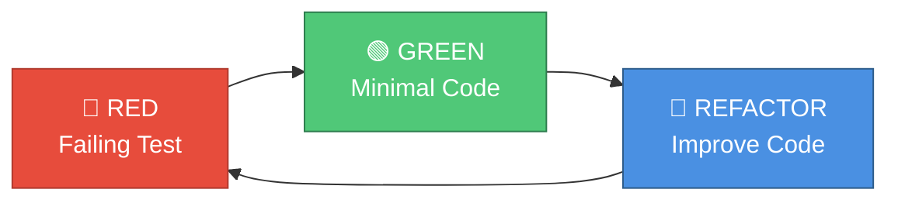

# 🔄 Процесс разработки

> TDD workflow и best practices за 30 минут

## Философия разработки

### KISS (Keep It Simple, Stupid)

- Максимальная простота
- Никаких абстракций "на будущее"
- Только необходимая функциональность

### Test-Driven Development (TDD)



**1. RED** — Напиши failing тест  
**2. GREEN** — Напиши минимальный код для прохождения  
**3. REFACTOR** — Улучши код (DRY, KISS)  
**4. Repeat** — Следующая функция

---

## Пошаговый workflow

### Шаг 1: Выбор задачи

Задачи описаны в `docs/tasklist.md` (итеративный план).

**Пример задачи:**
```markdown
### Итерация X: Добавить команду /stats
- [ ] Добавить метод get_conversation_summary() в DialogManager
- [ ] Добавить обработку команды /stats в ConsoleApp
- [ ] Написать тесты
```

---

### Шаг 2: Создание ветки (опционально)

```bash
# Создать ветку для задачи
git checkout -b feature/add-stats-command

# Или работать в main (для solo разработки)
```

---

### Шаг 3: TDD цикл

#### 🔴 RED Phase — Failing Test

1. Создать/открыть тестовый файл:

```bash
# Например, tests/test_dialog_manager.py
```

2. Написать failing тест:

```python
def test_get_conversation_summary():
    """Тест получения статистики диалога."""
    # Arrange
    manager = DialogManager(max_history=10)
    manager.add_user_message("Hello")
    manager.add_assistant_message("Hi!")
    
    # Act
    stats = manager.get_conversation_summary()
    
    # Assert
    assert stats["total_messages"] == 2
    assert stats["user_messages"] == 1
    assert stats["assistant_messages"] == 1
    assert stats["max_history"] == 10
```

3. Запустить тест (должен упасть):

```bash
make test
# ❌ FAILED: AttributeError: 'DialogManager' object has no attribute 'get_conversation_summary'
```

✅ **Критерий RED:** Тест падает по правильной причине (метод не существует).

---

#### 🟢 GREEN Phase — Minimal Implementation

4. Написать минимальный код:

```python
# src/dialog_manager.py

def get_conversation_summary(self) -> dict[str, int]:
    """Получить сводную статистику по диалогу."""
    user_messages = sum(1 for msg in self.history if msg["role"] == "user")
    assistant_messages = sum(1 for msg in self.history if msg["role"] == "assistant")
    
    return {
        "total_messages": len(self.history),
        "user_messages": user_messages,
        "assistant_messages": assistant_messages,
        "max_history": self.max_history,
    }
```

5. Запустить тест (должен пройти):

```bash
make test
# ✅ PASSED
```

✅ **Критерий GREEN:** Тест проходит с минимальной реализацией.

---

#### 🔵 REFACTOR Phase — Improve Code

6. Улучшить код (опционально):

```python
# Добавить type hints для возвращаемого значения
from typing import TypedDict

class ConversationStats(TypedDict):
    total_messages: int
    user_messages: int
    assistant_messages: int
    max_history: int

def get_conversation_summary(self) -> ConversationStats:
    ...
```

7. Запустить тесты снова (должны проходить):

```bash
make test
# ✅ PASSED
```

✅ **Критерий REFACTOR:** Все тесты проходят после рефакторинга.

---

### Шаг 4: Интеграция в UI (ConsoleApp)

Повторить TDD цикл для интеграции:

#### 🔴 RED

```python
# tests/test_console.py

@pytest.mark.asyncio
async def test_stats_command(console_app, capsys):
    """Тест команды /stats."""
    # Добавить сообщения
    console_app.dialog_manager.add_user_message("Test 1")
    console_app.dialog_manager.add_assistant_message("Response 1")
    
    # Обработать команду /stats
    is_exit = console_app._handle_command("/stats")
    
    # Проверить вывод
    captured = capsys.readouterr()
    assert "Всего сообщений: 2" in captured.out
    assert is_exit is False
```

#### 🟢 GREEN

```python
# src/console.py

def _handle_command(self, command: str) -> bool:
    if command == "/stats":
        stats = self.dialog_manager.get_conversation_summary()
        print(InfoMessages.STATS_HEADER.value)
        print(f"  Всего сообщений: {stats['total_messages']}")
        print(f"  Ваших сообщений: {stats['user_messages']}")
        print(f"  Ответов ассистента: {stats['assistant_messages']}")
        return False
    ...
```

#### 🔵 REFACTOR

```python
# Вынести форматирование в отдельный метод
def _display_stats(self) -> None:
    stats = self.dialog_manager.get_conversation_summary()
    print(InfoMessages.STATS_HEADER.value)
    print(f"  Всего сообщений: {stats['total_messages']}")
    ...

def _handle_command(self, command: str) -> bool:
    if command == "/stats":
        self._display_stats()
        return False
    ...
```

---

### Шаг 5: Проверка качества

```bash
make quality
```

Эта команда запускает:
1. ✅ **Форматирование** (`ruff format`)
2. ✅ **Линтинг** (`ruff check`)
3. ✅ **Проверка типов** (`mypy`)
4. ✅ **Тесты** (`pytest`)

**Все проверки должны пройти (0 ошибок).**

---

### Шаг 6: Коммит

```bash
# Добавить изменения
git add src/dialog_manager.py src/console.py tests/

# Коммит с описательным сообщением
git commit -m "Add /stats command to show conversation statistics

- Implement get_conversation_summary() in DialogManager
- Add /stats command handler in ConsoleApp
- Add tests for both components
- Coverage: 100% for new code"
```

**Формат коммита:**
```
Краткое описание изменения (до 50 символов)

Подробное описание:
- Что добавлено
- Что изменено
- Какие тесты
- Coverage метрики (опционально)
```

---

## Соглашения о коде

### Именование

```python
# ✅ Классы: PascalCase
class DialogManager:
    ...

# ✅ Функции/методы: snake_case
def get_conversation_summary():
    ...

# ✅ Переменные: snake_case
user_message = "Hello"

# ✅ Константы: UPPER_SNAKE_CASE
MAX_RETRIES = 3

# ✅ Приватные методы: _leading_underscore
def _trim_history(self):
    ...
```

---

### Структура модуля

```python
"""Краткое описание модуля."""

# 1. Стандартные библиотеки
import asyncio
from pathlib import Path

# 2. Сторонние библиотеки
from openai import AsyncOpenAI

# 3. Локальные импорты
from .config import Config
from .exceptions import LLMError

# 4. Константы
MAX_RETRIES = 3

# 5. Классы/функции
class MyClass:
    """Docstring для класса."""
    
    def my_method(self, param: str) -> int:
        """Docstring для метода.
        
        Args:
            param: Описание параметра
            
        Returns:
            Описание возвращаемого значения
        """
        ...
```

---

### Type Hints (обязательно)

```python
# ✅ Хорошо: все параметры и возвращаемые значения типизированы
def add_message(self, role: MessageRole, content: str) -> None:
    ...

# ❌ Плохо: без type hints
def add_message(self, role, content):
    ...
```

---

### Docstrings (обязательно для публичных методов)

```python
def get_response(self, message: str) -> str:
    """Получить ответ от LLM.
    
    Args:
        message: Сообщение пользователя
        
    Returns:
        Ответ ассистента
        
    Raises:
        LLMError: При ошибке обращения к LLM
    """
    ...
```

---

### Длина строки

**Максимум:** 100 символов

```python
# ✅ Хорошо: перенос длинной строки
response = await self.client.chat.completions.create(
    model=self.config.llm_model,
    messages=messages,
    temperature=self.config.llm_temperature,
)

# ❌ Плохо: очень длинная строка
response = await self.client.chat.completions.create(model=self.config.llm_model, messages=messages, temperature=self.config.llm_temperature)
```

---

## Тестирование

### Структура теста (AAA)

```python
def test_add_user_message():
    # Arrange — подготовка
    manager = DialogManager(max_history=10)
    
    # Act — действие
    manager.add_user_message("Hello")
    
    # Assert — проверка
    assert len(manager) == 1
    assert manager.get_history()[0]["role"] == "user"
```

---

### Параметризация

```python
import pytest

@pytest.mark.parametrize("max_history,expected_max", [
    (1, 2),   # 1 пара = 2 сообщения
    (5, 10),  # 5 пар = 10 сообщений
    (10, 20), # 10 пар = 20 сообщений
])
def test_history_trimming(max_history, expected_max):
    manager = DialogManager(max_history=max_history)
    
    # Добавить больше сообщений, чем лимит
    for i in range(expected_max + 2):
        manager.add_user_message(f"Message {i}")
    
    # Проверить, что обрезано до лимита
    assert len(manager) == expected_max
```

---

### Async тесты

```python
import pytest

@pytest.mark.asyncio
async def test_llm_client_get_response():
    """Тест асинхронного метода."""
    client = LLMClient(config)
    response = await client.get_response("Test", "System prompt", [])
    
    assert isinstance(response, str)
    assert len(response) > 0
```

---

### Моки для внешних API

```python
from unittest.mock import AsyncMock, patch

@pytest.mark.asyncio
async def test_llm_client_with_mock():
    """Тест с моком OpenAI API."""
    mock_response = Mock()
    mock_response.choices[0].message.content = "Mocked response"
    
    with patch.object(client.client.chat.completions, "create", 
                      new_callable=AsyncMock, return_value=mock_response):
        response = await client.get_response("Test", "Prompt", [])
        assert response == "Mocked response"
```

---

## Чек-лист перед коммитом

### ✅ Обязательные проверки

```bash
# 1. Форматирование
make format
# → 22 файла отформатировано

# 2. Линтинг
make lint
# → 0 ошибок

# 3. Проверка типов
make type-check
# → Success: no issues found in 11 source files

# 4. Тесты
make test
# → 149 passed, 87.59% coverage

# Или всё сразу:
make quality
```

---

### ✅ Вручную проверить

- [ ] Все новые функции покрыты тестами
- [ ] Все публичные методы имеют docstrings
- [ ] Все параметры и возвращаемые значения типизированы
- [ ] Нет хардкода (константы вынесены)
- [ ] Нет дублирования кода (DRY)
- [ ] Соблюдены соглашения об именовании
- [ ] Коммит сообщение описательное

---

## Debugging

### Логирование для отладки

```python
from .logger import get_logger

logger = get_logger("my_module")

# DEBUG уровень (установить LOG_LEVEL=DEBUG в .env)
logger.debug("Детали для отладки", variable=value, state=state)

# INFO уровень
logger.info("Событие", user_id=123)

# ERROR уровень
logger.error("Ошибка", error=str(e), error_type=type(e).__name__)
```

---

### Точки останова (breakpoint)

```python
def my_function():
    result = some_calculation()
    
    breakpoint()  # ← Остановка для отладки
    
    return result
```

Запуск:
```bash
python -m src.main
# Остановится на breakpoint(), можно исследовать переменные
```

---

### Запуск одного теста

```bash
# Один файл
pytest tests/test_dialog_manager.py

# Один тест
pytest tests/test_dialog_manager.py::test_add_user_message

# С verbose
pytest -v tests/test_dialog_manager.py

# С отладкой (останавливается на ошибках)
pytest --pdb tests/test_dialog_manager.py
```

---

## Как добавить новую функцию (пример)

### Задача: Добавить команду `/clear` для очистки истории

#### Шаг 1: Тест для DialogManager

```python
# tests/test_dialog_manager.py

def test_clear_history():
    """Тест очистки истории."""
    manager = DialogManager()
    manager.add_user_message("Test 1")
    manager.add_assistant_message("Response 1")
    
    manager.clear_history()  # ← Метод не существует (RED)
    
    assert len(manager) == 0
```

Запуск: `make test` → ❌ FAILED (метод не существует)

---

#### Шаг 2: Реализация в DialogManager

```python
# src/dialog_manager.py

def clear_history(self) -> None:
    """Очистить историю диалога."""
    self.history.clear()
    self.logger.info("История диалога очищена")
```

Запуск: `make test` → ✅ PASSED

---

#### Шаг 3: Тест для ConsoleApp

```python
# tests/test_console.py

def test_clear_command(console_app, capsys):
    """Тест команды /clear."""
    console_app.dialog_manager.add_user_message("Test")
    
    is_exit = console_app._handle_command("/clear")  # ← Обработка не существует (RED)
    
    captured = capsys.readouterr()
    assert "История очищена" in captured.out
    assert len(console_app.dialog_manager) == 0
    assert is_exit is False
```

---

#### Шаг 4: Реализация в ConsoleApp

```python
# src/console.py

def _handle_command(self, command: str) -> bool:
    ...
    elif command == "/clear":
        self.dialog_manager.clear_history()
        print(InfoMessages.HISTORY_CLEARED.value)
        return False
    ...
```

---

#### Шаг 5: Проверка качества

```bash
make quality
# ✅ Все проверки прошли
```

---

#### Шаг 6: Коммит

```bash
git add src/ tests/
git commit -m "Add /clear command to reset conversation history

- Implement clear_history() in DialogManager
- Add /clear command handler in ConsoleApp
- Add tests for both components
- Update /help with /clear description"
```

---

## Полезные команды

| Команда | Назначение |
|---------|-----------|
| `make quality` | Полная проверка качества |
| `make test` | Запустить все тесты |
| `make lint` | Проверить стиль кода |
| `make format` | Форматировать код |
| `make type-check` | Проверить типы |
| `pytest tests/test_X.py` | Запустить один тестовый файл |
| `pytest -k "test_name"` | Запустить тесты по имени |
| `pytest --cov-report=html` | HTML отчет покрытия |

---

## 📚 Следующие шаги

- **[Тестирование и качество](08_testing_and_quality.md)** — детали тестирования
- **[Tур по кодовой базе](03_codebase_tour.md)** — понять структуру кода
- **[Conventions](../conventions.md)** — полные правила разработки

---

**⏱️ Время изучения:** 30 минут  
**🎯 Следующий гайд:** [Тестирование и качество →](08_testing_and_quality.md)

