# 📊 Визуализация проекта

> Диаграммы и схемы для понимания проекта с разных точек зрения

## Содержание

1. [Общая архитектура](#общая-архитектура)
2. [Потоки данных](#потоки-данных)
3. [Последовательности взаимодействий](#последовательности-взаимодействий)
4. [Жизненные циклы](#жизненные-циклы)
5. [Граф зависимостей](#граф-зависимостей)
6. [Обработка ошибок](#обработка-ошибок)
7. [Модель данных](#модель-данных)
8. [Процессы и workflow](#процессы-и-workflow)

---

## Общая архитектура

### Высокоуровневая архитектура

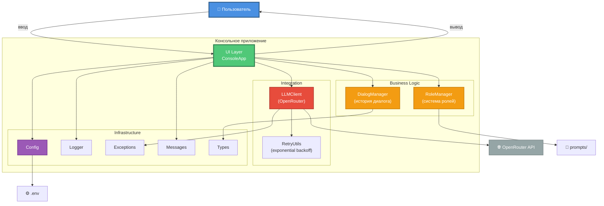
```mermaid
graph TB
    User["👤 Пользователь"]
    
    subgraph "Консольное приложение"
        UI["UI Layer<br/>ConsoleApp"]
        
        subgraph "Business Logic"
            Dialog["DialogManager<br/>(история диалога)"]
            Role["RoleManager<br/>(система ролей)"]
        end
        
        subgraph "Integration"
            LLM["LLMClient<br/>(OpenRouter)"]
            Retry["RetryUtils<br/>(exponential backoff)"]
        end
        
        subgraph "Infrastructure"
            Config["Config"]
            Logger["Logger"]
            Exceptions["Exceptions"]
            Messages["Messages"]
            Types["Types"]
        end
    end
    
    API["🌐 OpenRouter API"]
    Files["📁 prompts/"]
    Env["⚙️ .env"]
    
    User -->|ввод| UI
    UI -->|вывод| User
    
    UI --> Dialog
    UI --> Role
    UI --> LLM
    
    LLM --> Retry
    LLM --> API
    
    Role --> Files
    
    Config --> Env
    
    UI --> Config
    UI --> Logger
    UI --> Messages
    
    LLM --> Exceptions
    Dialog --> Types
    
    style User fill:#4a90e2,stroke:#2e5c8a,color:#fff,stroke-width:3px
    style UI fill:#50c878,stroke:#2e7d4e,color:#fff,stroke-width:3px
    style Dialog fill:#f39c12,stroke:#c87f0a,color:#fff,stroke-width:2px
    style Role fill:#f39c12,stroke:#c87f0a,color:#fff,stroke-width:2px
    style LLM fill:#e74c3c,stroke:#b03a2e,color:#fff,stroke-width:2px
    style API fill:#95a5a6,stroke:#7f8c8d,color:#fff,stroke-width:2px
    style Config fill:#9b59b6,stroke:#7d3c98,color:#fff,stroke-width:2px
```

---

### Детальная архитектура по слоям

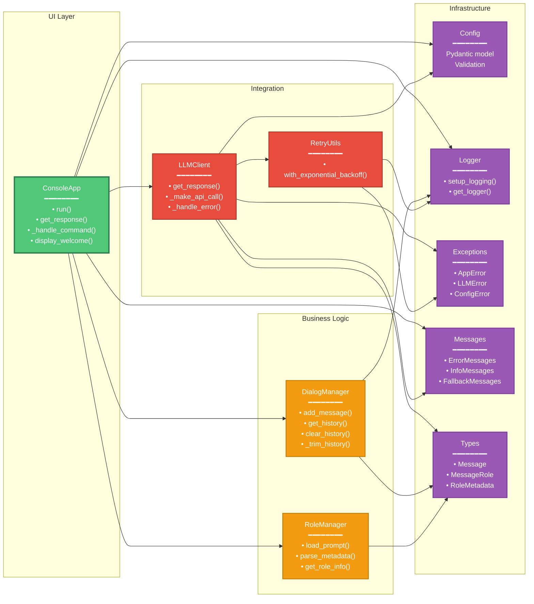
```mermaid
graph LR
    subgraph "UI Layer"
        Console["ConsoleApp<br/>━━━━━━━━<br/>• run()<br/>• get_response()<br/>• _handle_command()<br/>• display_welcome()"]
    end
    
    subgraph "Business Logic"
        Dialog["DialogManager<br/>━━━━━━━━<br/>• add_message()<br/>• get_history()<br/>• clear_history()<br/>• _trim_history()"]
        
        Role["RoleManager<br/>━━━━━━━━<br/>• load_prompt()<br/>• parse_metadata()<br/>• get_role_info()"]
    end
    
    subgraph "Integration"
        LLM["LLMClient<br/>━━━━━━━━<br/>• get_response()<br/>• _make_api_call()<br/>• _handle_error()"]
        
        Retry["RetryUtils<br/>━━━━━━━━<br/>• with_exponential_backoff()"]
    end
    
    subgraph "Infrastructure"
        Config["Config<br/>━━━━━━━━<br/>Pydantic model<br/>Validation"]
        
        Logger["Logger<br/>━━━━━━━━<br/>• setup_logging()<br/>• get_logger()"]
        
        Exceptions["Exceptions<br/>━━━━━━━━<br/>• AppError<br/>• LLMError<br/>• ConfigError"]
        
        Messages["Messages<br/>━━━━━━━━<br/>• ErrorMessages<br/>• InfoMessages<br/>• FallbackMessages"]
        
        Types["Types<br/>━━━━━━━━<br/>• Message<br/>• MessageRole<br/>• RoleMetadata"]
    end
    
    Console --> Dialog
    Console --> Role
    Console --> LLM
    Console --> Config
    Console --> Logger
    Console --> Messages
    
    LLM --> Retry
    LLM --> Config
    LLM --> Exceptions
    LLM --> Messages
    LLM --> Types
    
    Dialog --> Logger
    Dialog --> Types
    
    Role --> Types
    
    Retry --> Exceptions
    Retry --> Logger
    
    style Console fill:#50c878,stroke:#2e7d4e,color:#fff,stroke-width:3px
    style Dialog fill:#f39c12,stroke:#c87f0a,color:#fff,stroke-width:2px
    style Role fill:#f39c12,stroke:#c87f0a,color:#fff,stroke-width:2px
    style LLM fill:#e74c3c,stroke:#b03a2e,color:#fff,stroke-width:2px
    style Retry fill:#e74c3c,stroke:#b03a2e,color:#fff,stroke-width:2px
    style Config fill:#9b59b6,stroke:#7d3c98,color:#fff,stroke-width:2px
    style Logger fill:#9b59b6,stroke:#7d3c98,color:#fff,stroke-width:2px
    style Exceptions fill:#9b59b6,stroke:#7d3c98,color:#fff,stroke-width:2px
    style Messages fill:#9b59b6,stroke:#7d3c98,color:#fff,stroke-width:2px
    style Types fill:#9b59b6,stroke:#7d3c98,color:#fff,stroke-width:2px
```

---

## Потоки данных

### Основной поток обработки сообщения

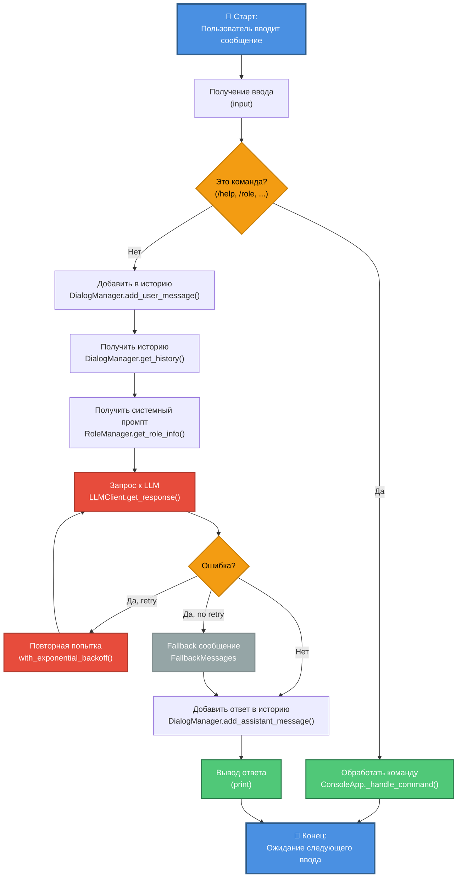
```mermaid
flowchart TD
    Start["🚀 Старт:<br/>Пользователь вводит сообщение"]
    
    Input["Получение ввода<br/>(input)"]
    
    CheckCmd{"Это команда?<br/>(/help, /role, ...)"}
    
    HandleCmd["Обработать команду<br/>ConsoleApp._handle_command()"]
    
    AddUser["Добавить в историю<br/>DialogManager.add_user_message()"]
    
    GetHistory["Получить историю<br/>DialogManager.get_history()"]
    
    GetPrompt["Получить системный промпт<br/>RoleManager.get_role_info()"]
    
    CallLLM["Запрос к LLM<br/>LLMClient.get_response()"]
    
    RetryCheck{"Ошибка?"}
    
    Retry["Повторная попытка<br/>with_exponential_backoff()"]
    
    Fallback["Fallback сообщение<br/>FallbackMessages"]
    
    AddAssistant["Добавить ответ в историю<br/>DialogManager.add_assistant_message()"]
    
    Display["Вывод ответа<br/>(print)"]
    
    End["🏁 Конец:<br/>Ожидание следующего ввода"]
    
    Start --> Input
    Input --> CheckCmd
    
    CheckCmd -->|Да| HandleCmd
    HandleCmd --> End
    
    CheckCmd -->|Нет| AddUser
    AddUser --> GetHistory
    GetHistory --> GetPrompt
    GetPrompt --> CallLLM
    
    CallLLM --> RetryCheck
    
    RetryCheck -->|Нет| AddAssistant
    RetryCheck -->|Да, retry| Retry
    RetryCheck -->|Да, no retry| Fallback
    
    Retry --> CallLLM
    Fallback --> AddAssistant
    
    AddAssistant --> Display
    Display --> End
    
    style Start fill:#4a90e2,stroke:#2e5c8a,color:#fff,stroke-width:3px
    style End fill:#4a90e2,stroke:#2e5c8a,color:#fff,stroke-width:3px
    style CheckCmd fill:#f39c12,stroke:#c87f0a,color:#000,stroke-width:2px
    style RetryCheck fill:#f39c12,stroke:#c87f0a,color:#000,stroke-width:2px
    style CallLLM fill:#e74c3c,stroke:#b03a2e,color:#fff,stroke-width:2px
    style Retry fill:#e74c3c,stroke:#b03a2e,color:#fff,stroke-width:2px
    style Fallback fill:#95a5a6,stroke:#7f8c8d,color:#fff,stroke-width:2px
    style HandleCmd fill:#50c878,stroke:#2e7d4e,color:#fff,stroke-width:2px
    style Display fill:#50c878,stroke:#2e7d4e,color:#fff,stroke-width:2px
```

---

### Поток данных: История диалога

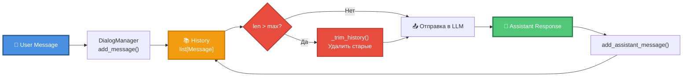
```mermaid
flowchart LR
    User["👤 User Message"]
    
    Add["DialogManager<br/>add_message()"]
    
    History["📚 History<br/>list[Message]"]
    
    Check{"len > max?"}
    
    Trim["_trim_history()<br/>Удалить старые"]
    
    LLM["📤 Отправка в LLM"]
    
    Response["🤖 Assistant Response"]
    
    AddResp["add_assistant_message()"]
    
    User --> Add
    Add --> History
    History --> Check
    
    Check -->|Да| Trim
    Check -->|Нет| LLM
    Trim --> LLM
    
    LLM --> Response
    Response --> AddResp
    AddResp --> History
    
    style User fill:#4a90e2,stroke:#2e5c8a,color:#fff,stroke-width:3px
    style History fill:#f39c12,stroke:#c87f0a,color:#fff,stroke-width:3px
    style Check fill:#e74c3c,stroke:#b03a2e,color:#fff,stroke-width:2px
    style Trim fill:#e74c3c,stroke:#b03a2e,color:#fff,stroke-width:2px
    style Response fill:#50c878,stroke:#2e7d4e,color:#fff,stroke-width:3px
```

---

## Последовательности взаимодействий

### Успешный диалог (Happy Path)

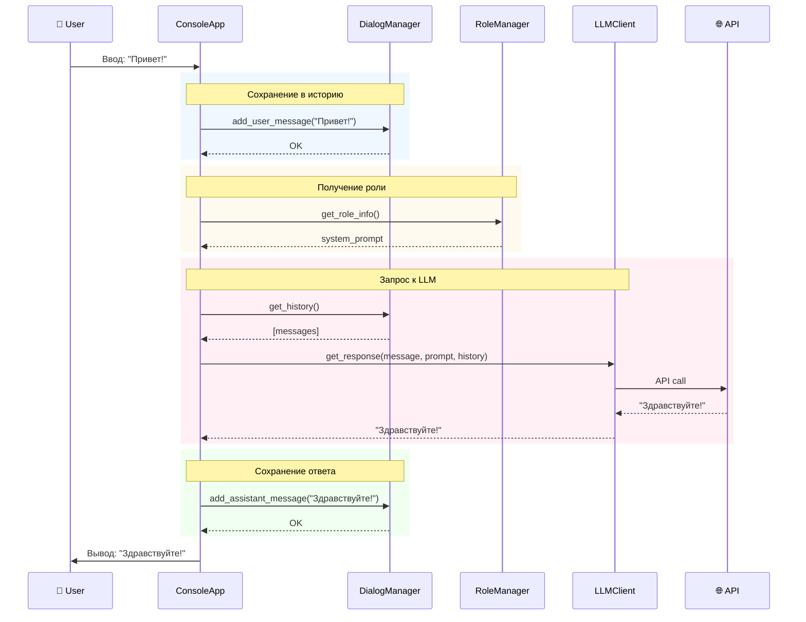
```mermaid
sequenceDiagram
    participant U as 👤 User
    participant C as ConsoleApp
    participant D as DialogManager
    participant R as RoleManager
    participant L as LLMClient
    participant A as 🌐 API
    
    U->>C: Ввод: "Привет!"
    
    rect rgb(240, 248, 255)
        Note over C,D: Сохранение в историю
        C->>D: add_user_message("Привет!")
        D-->>C: OK
    end
    
    rect rgb(255, 250, 240)
        Note over C,R: Получение роли
        C->>R: get_role_info()
        R-->>C: system_prompt
    end
    
    rect rgb(255, 240, 245)
        Note over C,L: Запрос к LLM
        C->>D: get_history()
        D-->>C: [messages]
        
        C->>L: get_response(message, prompt, history)
        L->>A: API call
        A-->>L: "Здравствуйте!"
        L-->>C: "Здравствуйте!"
    end
    
    rect rgb(240, 255, 240)
        Note over C,D: Сохранение ответа
        C->>D: add_assistant_message("Здравствуйте!")
        D-->>C: OK
    end
    
    C->>U: Вывод: "Здравствуйте!"
```

---

### Обработка ошибки с retry

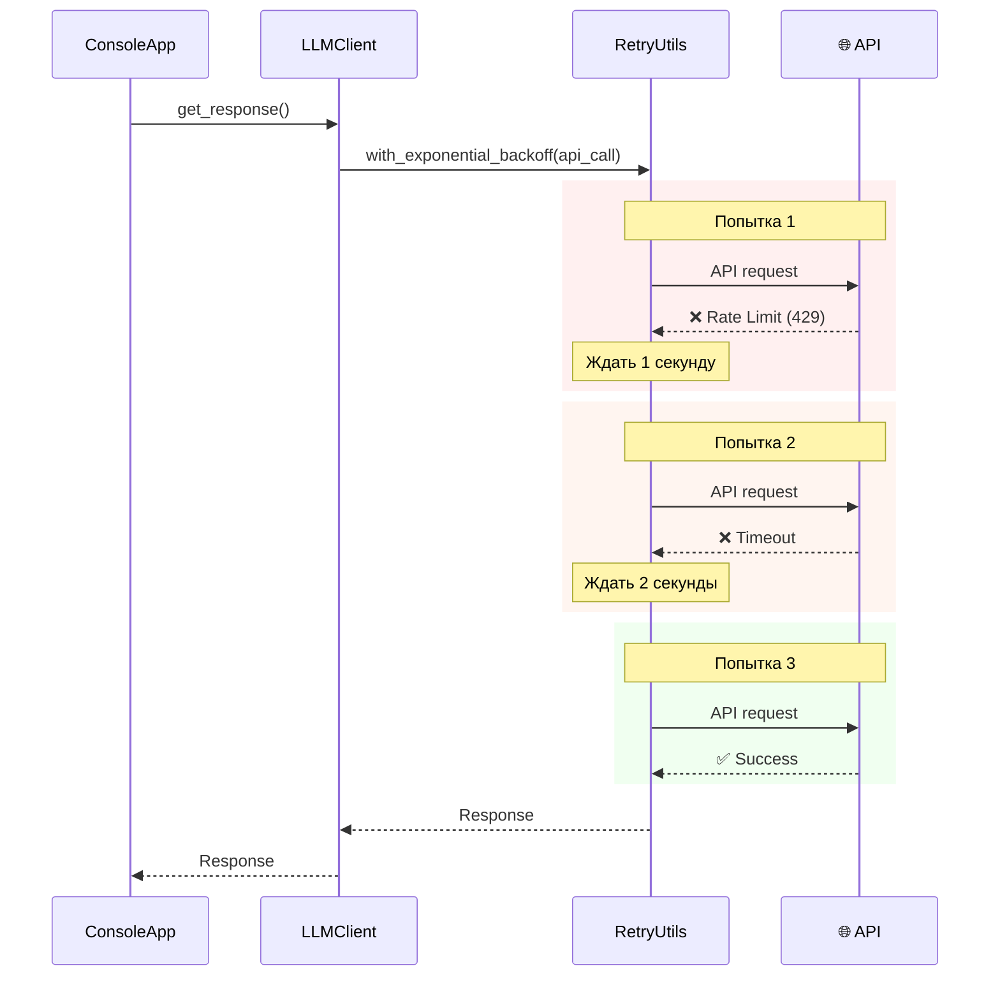
```mermaid
sequenceDiagram
    participant C as ConsoleApp
    participant L as LLMClient
    participant R as RetryUtils
    participant A as 🌐 API
    
    C->>L: get_response()
    
    L->>R: with_exponential_backoff(api_call)
    
    rect rgb(255, 240, 240)
        Note over R,A: Попытка 1
        R->>A: API request
        A-->>R: ❌ Rate Limit (429)
        Note over R: Ждать 1 секунду
    end
    
    rect rgb(255, 245, 240)
        Note over R,A: Попытка 2
        R->>A: API request
        A-->>R: ❌ Timeout
        Note over R: Ждать 2 секунды
    end
    
    rect rgb(240, 255, 240)
        Note over R,A: Попытка 3
        R->>A: API request
        A-->>R: ✅ Success
    end
    
    R-->>L: Response
    L-->>C: Response
```

---

### Обработка команды /role

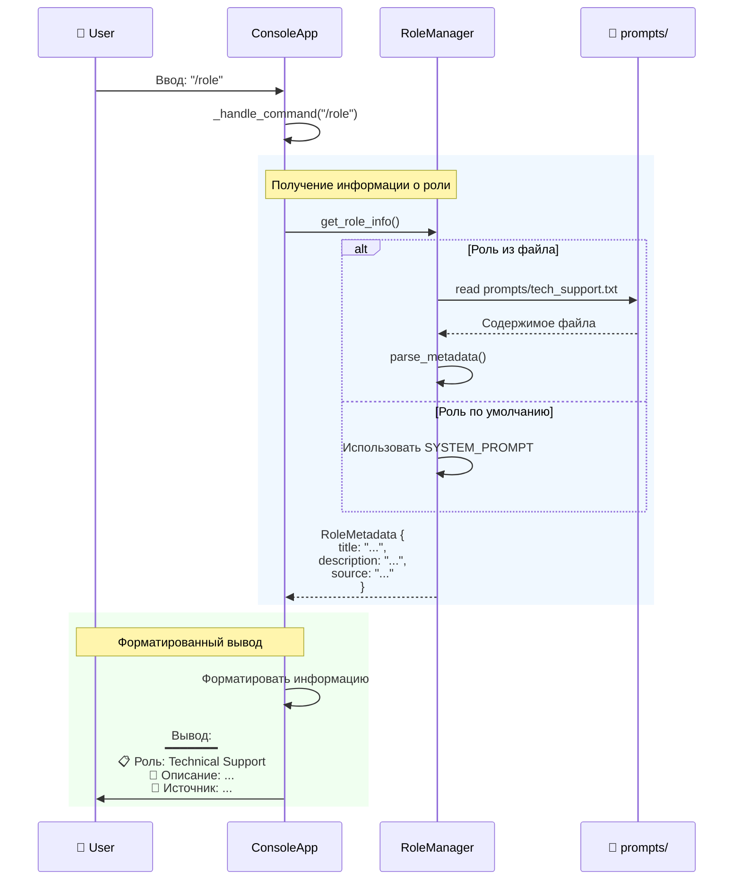
```mermaid
sequenceDiagram
    participant U as 👤 User
    participant C as ConsoleApp
    participant R as RoleManager
    participant F as 📁 prompts/
    
    U->>C: Ввод: "/role"
    
    C->>C: _handle_command("/role")
    
    rect rgb(240, 248, 255)
        Note over C,R: Получение информации о роли
        C->>R: get_role_info()
        
        alt Роль из файла
            R->>F: read prompts/tech_support.txt
            F-->>R: Содержимое файла
            R->>R: parse_metadata()
        else Роль по умолчанию
            R->>R: Использовать SYSTEM_PROMPT
        end
        
        R-->>C: RoleMetadata {<br/>  title: "...",<br/>  description: "...",<br/>  source: "..."<br/>}
    end
    
    rect rgb(240, 255, 240)
        Note over C,U: Форматированный вывод
        C->>C: Форматировать информацию
        C->>U: Вывод:<br/>━━━━━━━<br/>📋 Роль: Technical Support<br/>📝 Описание: ...<br/>📁 Источник: ...
    end
```

---

## Жизненные циклы

### Жизненный цикл приложения

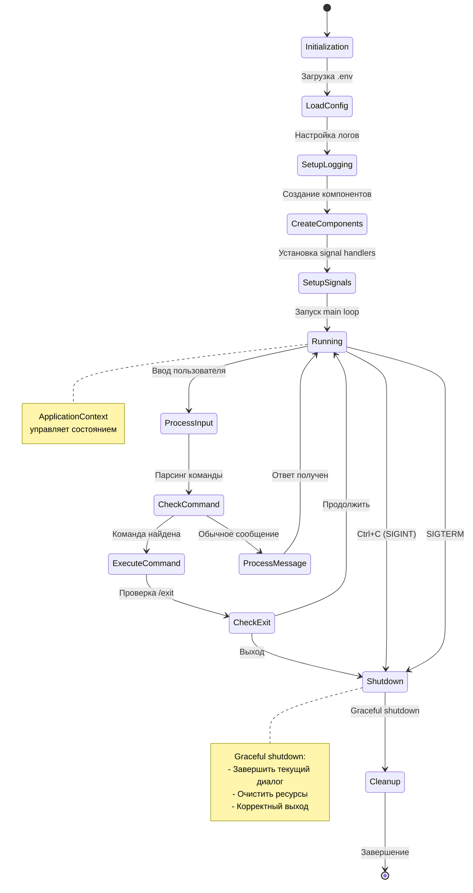
```mermaid
stateDiagram-v2
    [*] --> Initialization
    
    Initialization --> LoadConfig: Загрузка .env
    LoadConfig --> SetupLogging: Настройка логов
    SetupLogging --> CreateComponents: Создание компонентов
    CreateComponents --> SetupSignals: Установка signal handlers
    SetupSignals --> Running: Запуск main loop
    
    Running --> ProcessInput: Ввод пользователя
    
    ProcessInput --> CheckCommand: Парсинг команды
    
    CheckCommand --> ExecuteCommand: Команда найдена
    CheckCommand --> ProcessMessage: Обычное сообщение
    
    ExecuteCommand --> CheckExit: Проверка /exit
    ProcessMessage --> Running: Ответ получен
    
    CheckExit --> Running: Продолжить
    CheckExit --> Shutdown: Выход
    
    Running --> Shutdown: Ctrl+C (SIGINT)
    Running --> Shutdown: SIGTERM
    
    Shutdown --> Cleanup: Graceful shutdown
    Cleanup --> [*]: Завершение
    
    note right of Running
        ApplicationContext
        управляет состоянием
    end note
    
    note right of Shutdown
        Graceful shutdown:
        - Завершить текущий диалог
        - Очистить ресурсы
        - Корректный выход
    end note
```

---

### Жизненный цикл LLM запроса

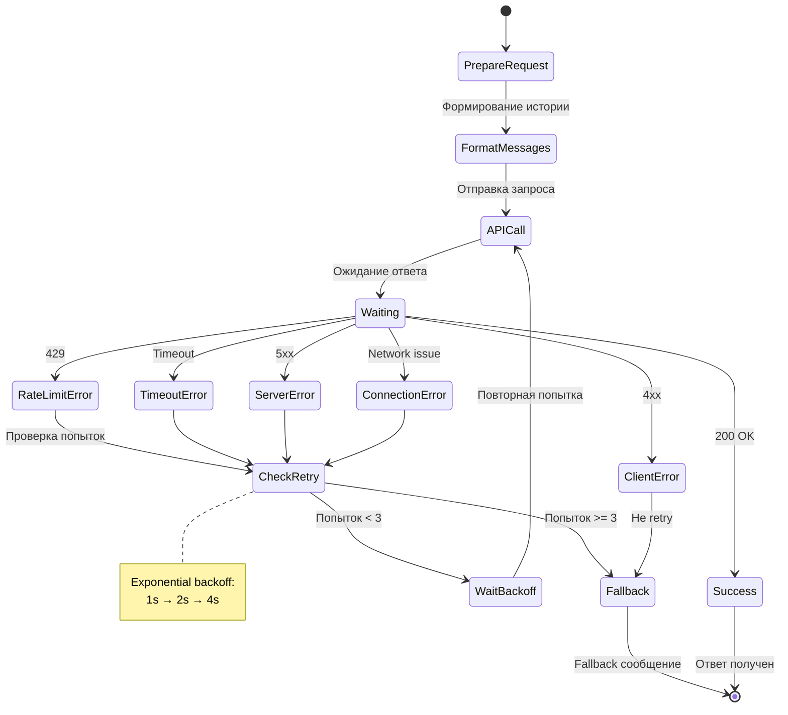
```mermaid
stateDiagram-v2
    [*] --> PrepareRequest
    
    PrepareRequest --> FormatMessages: Формирование истории
    FormatMessages --> APICall: Отправка запроса
    
    APICall --> Waiting: Ожидание ответа
    
    Waiting --> Success: 200 OK
    Waiting --> RateLimitError: 429
    Waiting --> TimeoutError: Timeout
    Waiting --> ServerError: 5xx
    Waiting --> ClientError: 4xx
    Waiting --> ConnectionError: Network issue
    
    RateLimitError --> CheckRetry: Проверка попыток
    TimeoutError --> CheckRetry
    ServerError --> CheckRetry
    ConnectionError --> CheckRetry
    
    CheckRetry --> WaitBackoff: Попыток < 3
    CheckRetry --> Fallback: Попыток >= 3
    
    WaitBackoff --> APICall: Повторная попытка
    
    ClientError --> Fallback: Не retry
    
    Fallback --> [*]: Fallback сообщение
    Success --> [*]: Ответ получен
    
    note right of CheckRetry
        Exponential backoff:
        1s → 2s → 4s
    end note
```

---

### Жизненный цикл истории диалога

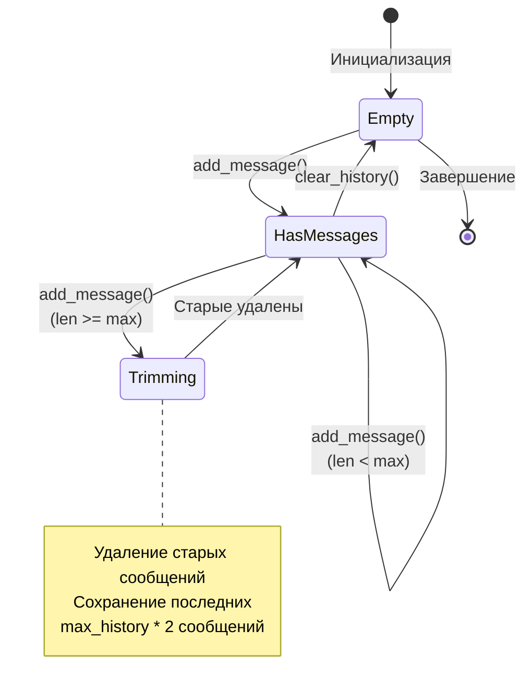
```mermaid
stateDiagram-v2
    [*] --> Empty: Инициализация
    
    Empty --> HasMessages: add_message()
    
    HasMessages --> HasMessages: add_message()<br/>(len < max)
    
    HasMessages --> Trimming: add_message()<br/>(len >= max)
    
    Trimming --> HasMessages: Старые удалены
    
    HasMessages --> Empty: clear_history()
    
    Empty --> [*]: Завершение
    
    note right of Trimming
        Удаление старых сообщений
        Сохранение последних
        max_history * 2 сообщений
    end note
```

---

## Граф зависимостей

### Полный граф зависимостей модулей

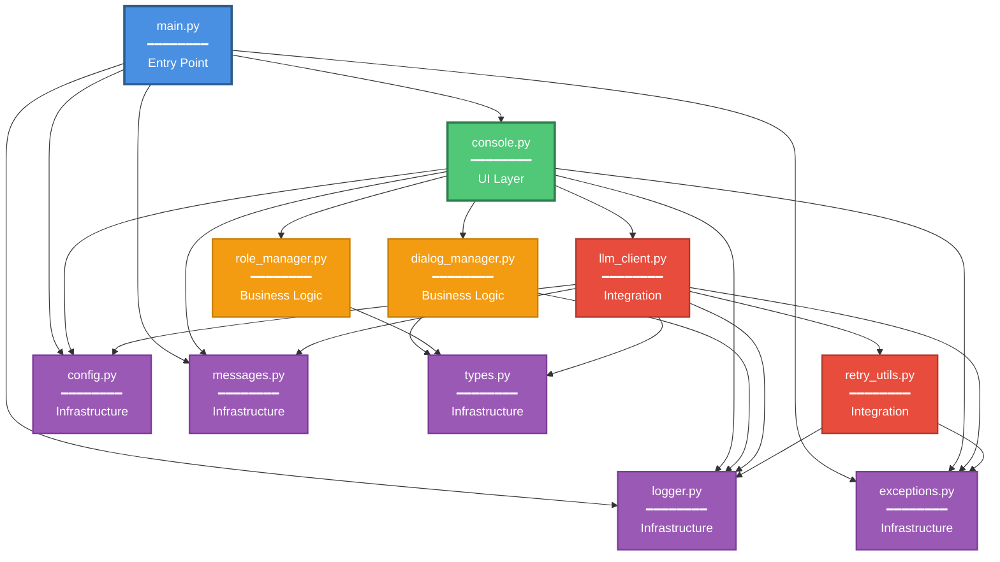
```mermaid
graph TB
    main["main.py<br/>━━━━━━━━<br/>Entry Point"]
    
    console["console.py<br/>━━━━━━━━<br/>UI Layer"]
    
    dialog["dialog_manager.py<br/>━━━━━━━━<br/>Business Logic"]
    
    role["role_manager.py<br/>━━━━━━━━<br/>Business Logic"]
    
    llm["llm_client.py<br/>━━━━━━━━<br/>Integration"]
    
    retry["retry_utils.py<br/>━━━━━━━━<br/>Integration"]
    
    config["config.py<br/>━━━━━━━━<br/>Infrastructure"]
    
    logger["logger.py<br/>━━━━━━━━<br/>Infrastructure"]
    
    exceptions["exceptions.py<br/>━━━━━━━━<br/>Infrastructure"]
    
    messages["messages.py<br/>━━━━━━━━<br/>Infrastructure"]
    
    types["types.py<br/>━━━━━━━━<br/>Infrastructure"]
    
    main --> console
    main --> config
    main --> logger
    main --> exceptions
    main --> messages
    
    console --> dialog
    console --> role
    console --> llm
    console --> config
    console --> logger
    console --> exceptions
    console --> messages
    
    dialog --> logger
    dialog --> types
    
    role --> types
    
    llm --> retry
    llm --> config
    llm --> logger
    llm --> exceptions
    llm --> messages
    llm --> types
    
    retry --> logger
    retry --> exceptions
    
    style main fill:#4a90e2,stroke:#2e5c8a,color:#fff,stroke-width:3px
    style console fill:#50c878,stroke:#2e7d4e,color:#fff,stroke-width:3px
    style dialog fill:#f39c12,stroke:#c87f0a,color:#fff,stroke-width:2px
    style role fill:#f39c12,stroke:#c87f0a,color:#fff,stroke-width:2px
    style llm fill:#e74c3c,stroke:#b03a2e,color:#fff,stroke-width:2px
    style retry fill:#e74c3c,stroke:#b03a2e,color:#fff,stroke-width:2px
    style config fill:#9b59b6,stroke:#7d3c98,color:#fff,stroke-width:2px
    style logger fill:#9b59b6,stroke:#7d3c98,color:#fff,stroke-width:2px
    style exceptions fill:#9b59b6,stroke:#7d3c98,color:#fff,stroke-width:2px
    style messages fill:#9b59b6,stroke:#7d3c98,color:#fff,stroke-width:2px
    style types fill:#9b59b6,stroke:#7d3c98,color:#fff,stroke-width:2px
```

---

### Зависимости по слоям (правило направления)

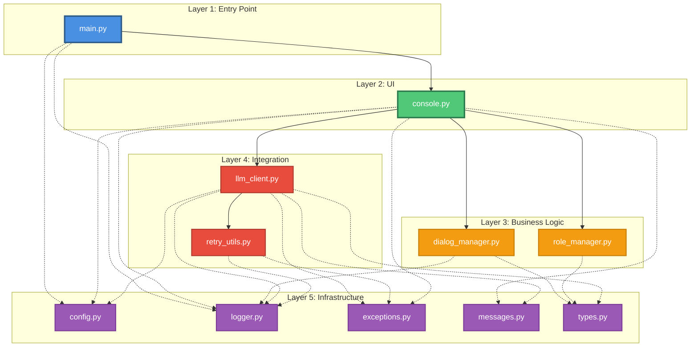
```mermaid
graph TD
    subgraph "Layer 1: Entry Point"
        main["main.py"]
    end
    
    subgraph "Layer 2: UI"
        console["console.py"]
    end
    
    subgraph "Layer 3: Business Logic"
        dialog["dialog_manager.py"]
        role["role_manager.py"]
    end
    
    subgraph "Layer 4: Integration"
        llm["llm_client.py"]
        retry["retry_utils.py"]
    end
    
    subgraph "Layer 5: Infrastructure"
        config["config.py"]
        logger["logger.py"]
        exceptions["exceptions.py"]
        messages["messages.py"]
        types["types.py"]
    end
    
    main --> console
    console --> dialog
    console --> role
    console --> llm
    
    llm --> retry
    
    main -.-> config
    main -.-> logger
    console -.-> config
    console -.-> logger
    dialog -.-> logger
    llm -.-> config
    llm -.-> logger
    retry -.-> logger
    
    llm -.-> exceptions
    retry -.-> exceptions
    console -.-> exceptions
    
    console -.-> messages
    llm -.-> messages
    
    dialog -.-> types
    role -.-> types
    llm -.-> types
    
    style main fill:#4a90e2,stroke:#2e5c8a,color:#fff,stroke-width:3px
    style console fill:#50c878,stroke:#2e7d4e,color:#fff,stroke-width:3px
    style dialog fill:#f39c12,stroke:#c87f0a,color:#fff,stroke-width:2px
    style role fill:#f39c12,stroke:#c87f0a,color:#fff,stroke-width:2px
    style llm fill:#e74c3c,stroke:#b03a2e,color:#fff,stroke-width:2px
    style retry fill:#e74c3c,stroke:#b03a2e,color:#fff,stroke-width:2px
    style config fill:#9b59b6,stroke:#7d3c98,color:#fff,stroke-width:2px
    style logger fill:#9b59b6,stroke:#7d3c98,color:#fff,stroke-width:2px
    style exceptions fill:#9b59b6,stroke:#7d3c98,color:#fff,stroke-width:2px
    style messages fill:#9b59b6,stroke:#7d3c98,color:#fff,stroke-width:2px
    style types fill:#9b59b6,stroke:#7d3c98,color:#fff,stroke-width:2px
```

---

## Обработка ошибок

### Иерархия исключений

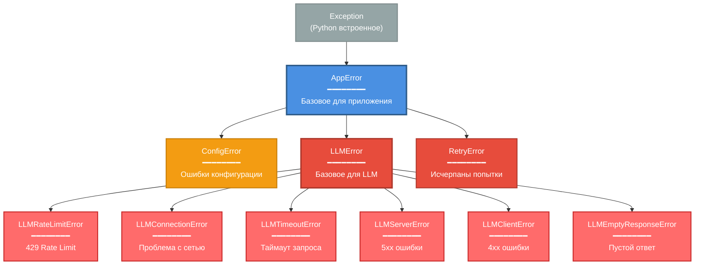
```mermaid
graph TD
    Base["Exception<br/>(Python встроенное)"]
    
    App["AppError<br/>━━━━━━━━<br/>Базовое для приложения"]
    
    Config["ConfigError<br/>━━━━━━━━<br/>Ошибки конфигурации"]
    
    LLM["LLMError<br/>━━━━━━━━<br/>Базовое для LLM"]
    
    Retry["RetryError<br/>━━━━━━━━<br/>Исчерпаны попытки"]
    
    RateLimit["LLMRateLimitError<br/>━━━━━━━━<br/>429 Rate Limit"]
    
    Connection["LLMConnectionError<br/>━━━━━━━━<br/>Проблема с сетью"]
    
    Timeout["LLMTimeoutError<br/>━━━━━━━━<br/>Таймаут запроса"]
    
    Server["LLMServerError<br/>━━━━━━━━<br/>5xx ошибки"]
    
    Client["LLMClientError<br/>━━━━━━━━<br/>4xx ошибки"]
    
    Empty["LLMEmptyResponseError<br/>━━━━━━━━<br/>Пустой ответ"]
    
    Base --> App
    
    App --> Config
    App --> LLM
    App --> Retry
    
    LLM --> RateLimit
    LLM --> Connection
    LLM --> Timeout
    LLM --> Server
    LLM --> Client
    LLM --> Empty
    
    style Base fill:#95a5a6,stroke:#7f8c8d,color:#fff,stroke-width:2px
    style App fill:#4a90e2,stroke:#2e5c8a,color:#fff,stroke-width:3px
    style Config fill:#f39c12,stroke:#c87f0a,color:#fff,stroke-width:2px
    style LLM fill:#e74c3c,stroke:#b03a2e,color:#fff,stroke-width:3px
    style Retry fill:#e74c3c,stroke:#b03a2e,color:#fff,stroke-width:2px
    style RateLimit fill:#ff6b6b,stroke:#c92a2a,color:#fff,stroke-width:2px
    style Connection fill:#ff6b6b,stroke:#c92a2a,color:#fff,stroke-width:2px
    style Timeout fill:#ff6b6b,stroke:#c92a2a,color:#fff,stroke-width:2px
    style Server fill:#ff6b6b,stroke:#c92a2a,color:#fff,stroke-width:2px
    style Client fill:#ff6b6b,stroke:#c92a2a,color:#fff,stroke-width:2px
    style Empty fill:#ff6b6b,stroke:#c92a2a,color:#fff,stroke-width:2px
```

---

### Стратегия обработки ошибок API

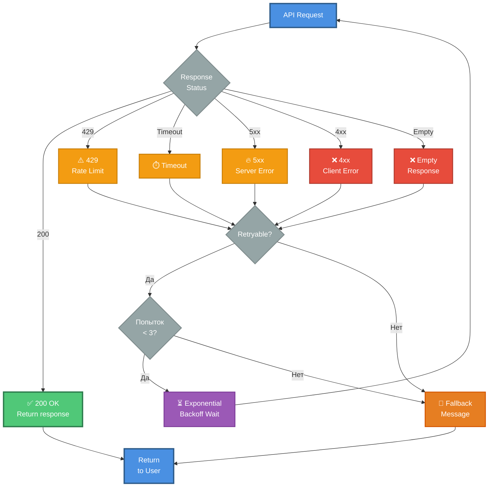
```mermaid
graph TD
    Start["API Request"]
    
    Success{"Response<br/>Status"}
    
    OK["✅ 200 OK<br/>Return response"]
    
    RateLimit["⚠️ 429<br/>Rate Limit"]
    
    Timeout["⏱️ Timeout"]
    
    Server["🔥 5xx<br/>Server Error"]
    
    Client["❌ 4xx<br/>Client Error"]
    
    Empty["❌ Empty<br/>Response"]
    
    Retryable{"Retryable?"}
    
    CheckAttempts{"Попыток<br/>< 3?"}
    
    Wait["⏳ Exponential<br/>Backoff Wait"]
    
    Fallback["💬 Fallback<br/>Message"]
    
    Return["Return<br/>to User"]
    
    Start --> Success
    
    Success -->|200| OK
    Success -->|429| RateLimit
    Success -->|Timeout| Timeout
    Success -->|5xx| Server
    Success -->|4xx| Client
    Success -->|Empty| Empty
    
    OK --> Return
    
    RateLimit --> Retryable
    Timeout --> Retryable
    Server --> Retryable
    Client --> Retryable
    Empty --> Retryable
    
    Retryable -->|Да| CheckAttempts
    Retryable -->|Нет| Fallback
    
    CheckAttempts -->|Да| Wait
    CheckAttempts -->|Нет| Fallback
    
    Wait --> Start
    
    Fallback --> Return
    
    style Start fill:#4a90e2,stroke:#2e5c8a,color:#fff,stroke-width:3px
    style OK fill:#50c878,stroke:#2e7d4e,color:#fff,stroke-width:3px
    style RateLimit fill:#f39c12,stroke:#c87f0a,color:#fff,stroke-width:2px
    style Timeout fill:#f39c12,stroke:#c87f0a,color:#fff,stroke-width:2px
    style Server fill:#f39c12,stroke:#c87f0a,color:#fff,stroke-width:2px
    style Client fill:#e74c3c,stroke:#b03a2e,color:#fff,stroke-width:2px
    style Empty fill:#e74c3c,stroke:#b03a2e,color:#fff,stroke-width:2px
    style Success fill:#95a5a6,stroke:#7f8c8d,color:#fff,stroke-width:2px
    style Retryable fill:#95a5a6,stroke:#7f8c8d,color:#fff,stroke-width:2px
    style CheckAttempts fill:#95a5a6,stroke:#7f8c8d,color:#fff,stroke-width:2px
    style Wait fill:#9b59b6,stroke:#7d3c98,color:#fff,stroke-width:2px
    style Fallback fill:#e67e22,stroke:#d35400,color:#fff,stroke-width:2px
    style Return fill:#4a90e2,stroke:#2e5c8a,color:#fff,stroke-width:3px
```

---

## Модель данных

### Структуры данных и их связи

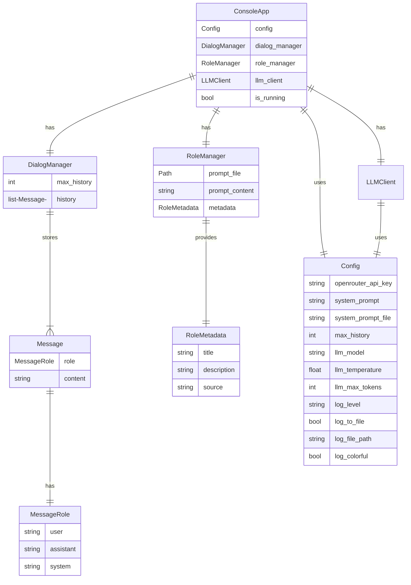
```mermaid
erDiagram
    Message {
        MessageRole role
        string content
    }
    
    MessageRole {
        string user
        string assistant
        string system
    }
    
    RoleMetadata {
        string title
        string description
        string source
    }
    
    Config {
        string openrouter_api_key
        string system_prompt
        string system_prompt_file
        int max_history
        string llm_model
        float llm_temperature
        int llm_max_tokens
        string log_level
        bool log_to_file
        string log_file_path
        bool log_colorful
    }
    
    DialogManager {
        int max_history
        list-Message- history
    }
    
    RoleManager {
        Path prompt_file
        string prompt_content
        RoleMetadata metadata
    }
    
    ConsoleApp {
        Config config
        DialogManager dialog_manager
        RoleManager role_manager
        LLMClient llm_client
        bool is_running
    }
    
    ConsoleApp ||--|| Config : "uses"
    ConsoleApp ||--|| DialogManager : "has"
    ConsoleApp ||--|| RoleManager : "has"
    ConsoleApp ||--|| LLMClient : "has"
    
    DialogManager ||--|{ Message : "stores"
    Message ||--|| MessageRole : "has"
    
    RoleManager ||--|| RoleMetadata : "provides"
    
    LLMClient ||--|| Config : "uses"
```

---

### Типизация: от общего к конкретному

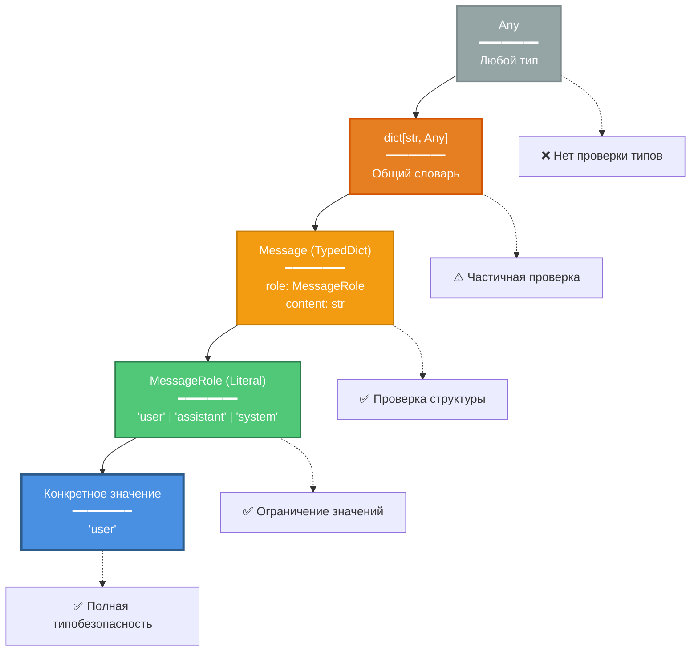
```mermaid
graph TD
    Any["Any<br/>━━━━━━━━<br/>Любой тип"]
    
    Dict["dict[str, Any]<br/>━━━━━━━━<br/>Общий словарь"]
    
    TypedDict["Message (TypedDict)<br/>━━━━━━━━<br/>role: MessageRole<br/>content: str"]
    
    Literal["MessageRole (Literal)<br/>━━━━━━━━<br/>'user' | 'assistant' | 'system'"]
    
    Concrete["Конкретное значение<br/>━━━━━━━━<br/>'user'"]
    
    Any --> Dict
    Dict --> TypedDict
    TypedDict --> Literal
    Literal --> Concrete
    
    style Any fill:#95a5a6,stroke:#7f8c8d,color:#fff,stroke-width:2px
    style Dict fill:#e67e22,stroke:#d35400,color:#fff,stroke-width:2px
    style TypedDict fill:#f39c12,stroke:#c87f0a,color:#fff,stroke-width:2px
    style Literal fill:#50c878,stroke:#2e7d4e,color:#fff,stroke-width:2px
    style Concrete fill:#4a90e2,stroke:#2e5c8a,color:#fff,stroke-width:3px
    
    Note1["❌ Нет проверки типов"]
    Note2["⚠️ Частичная проверка"]
    Note3["✅ Проверка структуры"]
    Note4["✅ Ограничение значений"]
    Note5["✅ Полная типобезопасность"]
    
    Any -.-> Note1
    Dict -.-> Note2
    TypedDict -.-> Note3
    Literal -.-> Note4
    Concrete -.-> Note5
```

---

## Процессы и workflow

### TDD Workflow (Test-Driven Development)

```mermaid
graph LR
    subgraph "🔴 RED Phase"
        WriteTest["Написать<br/>failing тест"]
        RunTest1["Запустить тест"]
        VerifyFail["Убедиться,<br/>что падает"]
    end
    
    subgraph "🟢 GREEN Phase"
        WriteCode["Написать<br/>минимальный код"]
        RunTest2["Запустить тест"]
        VerifyPass["Убедиться,<br/>что проходит"]
    end
    
    subgraph "🔵 REFACTOR Phase"
        ImproveCode["Улучшить код<br/>(DRY, KISS)"]
        RunTest3["Запустить тесты"]
        VerifyStillPass["Всё еще<br/>проходит?"]
    end
    
    Next["Следующая<br/>функция"]
    
    WriteTest --> RunTest1
    RunTest1 --> VerifyFail
    
    VerifyFail --> WriteCode
    
    WriteCode --> RunTest2
    RunTest2 --> VerifyPass
    
    VerifyPass --> ImproveCode
    
    ImproveCode --> RunTest3
    RunTest3 --> VerifyStillPass
    
    VerifyStillPass -->|Да| Next
    VerifyStillPass -->|Нет| ImproveCode
    
    Next --> WriteTest
    
    style WriteTest fill:#e74c3c,stroke:#b03a2e,color:#fff,stroke-width:3px
    style RunTest1 fill:#e74c3c,stroke:#b03a2e,color:#fff,stroke-width:2px
    style VerifyFail fill:#e74c3c,stroke:#b03a2e,color:#fff,stroke-width:2px
    
    style WriteCode fill:#50c878,stroke:#2e7d4e,color:#fff,stroke-width:3px
    style RunTest2 fill:#50c878,stroke:#2e7d4e,color:#fff,stroke-width:2px
    style VerifyPass fill:#50c878,stroke:#2e7d4e,color:#fff,stroke-width:2px
    
    style ImproveCode fill:#4a90e2,stroke:#2e5c8a,color:#fff,stroke-width:3px
    style RunTest3 fill:#4a90e2,stroke:#2e5c8a,color:#fff,stroke-width:2px
    style VerifyStillPass fill:#4a90e2,stroke:#2e5c8a,color:#fff,stroke-width:2px
    
    style Next fill:#f39c12,stroke:#c87f0a,color:#fff,stroke-width:3px
```

---

### CI/CD Pipeline качества кода

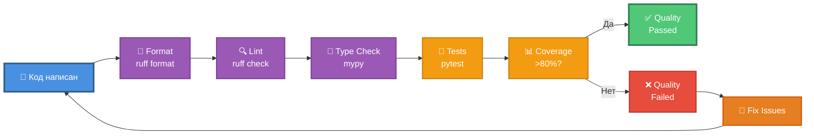
```mermaid
graph LR
    Start["📝 Код написан"]
    
    Format["🎨 Format<br/>ruff format"]
    
    Lint["🔍 Lint<br/>ruff check"]
    
    Types["📘 Type Check<br/>mypy"]
    
    Test["🧪 Tests<br/>pytest"]
    
    Coverage["📊 Coverage<br/>>80%?"]
    
    Success["✅ Quality<br/>Passed"]
    
    Fail["❌ Quality<br/>Failed"]
    
    Fix["🔧 Fix Issues"]
    
    Start --> Format
    Format --> Lint
    Lint --> Types
    Types --> Test
    Test --> Coverage
    
    Coverage -->|Да| Success
    Coverage -->|Нет| Fail
    
    Fail --> Fix
    Fix --> Start
    
    style Start fill:#4a90e2,stroke:#2e5c8a,color:#fff,stroke-width:3px
    style Format fill:#9b59b6,stroke:#7d3c98,color:#fff,stroke-width:2px
    style Lint fill:#9b59b6,stroke:#7d3c98,color:#fff,stroke-width:2px
    style Types fill:#9b59b6,stroke:#7d3c98,color:#fff,stroke-width:2px
    style Test fill:#f39c12,stroke:#c87f0a,color:#fff,stroke-width:2px
    style Coverage fill:#f39c12,stroke:#c87f0a,color:#fff,stroke-width:2px
    style Success fill:#50c878,stroke:#2e7d4e,color:#fff,stroke-width:3px
    style Fail fill:#e74c3c,stroke:#b03a2e,color:#fff,stroke-width:2px
    style Fix fill:#e67e22,stroke:#d35400,color:#fff,stroke-width:2px
```

---

### Процесс разработки новой функции

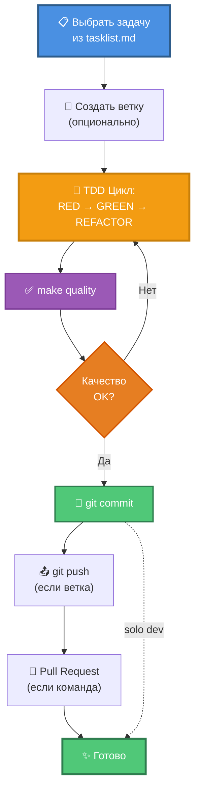
```mermaid
flowchart TD
    Task["📋 Выбрать задачу<br/>из tasklist.md"]
    
    Branch["🌿 Создать ветку<br/>(опционально)"]
    
    TDD["🔄 TDD Цикл:<br/>RED → GREEN → REFACTOR"]
    
    Quality["✅ make quality"]
    
    CheckQuality{"Качество<br/>OK?"}
    
    Commit["💾 git commit"]
    
    Push["📤 git push<br/>(если ветка)"]
    
    PR["🔀 Pull Request<br/>(если команда)"]
    
    Done["✨ Готово"]
    
    Task --> Branch
    Branch --> TDD
    TDD --> Quality
    Quality --> CheckQuality
    
    CheckQuality -->|Да| Commit
    CheckQuality -->|Нет| TDD
    
    Commit --> Push
    Push --> PR
    PR --> Done
    
    Commit -.->|solo dev| Done
    
    style Task fill:#4a90e2,stroke:#2e5c8a,color:#fff,stroke-width:3px
    style TDD fill:#f39c12,stroke:#c87f0a,color:#fff,stroke-width:3px
    style Quality fill:#9b59b6,stroke:#7d3c98,color:#fff,stroke-width:2px
    style CheckQuality fill:#e67e22,stroke:#d35400,color:#fff,stroke-width:2px
    style Commit fill:#50c878,stroke:#2e7d4e,color:#fff,stroke-width:2px
    style Done fill:#50c878,stroke:#2e7d4e,color:#fff,stroke-width:3px
```

---

## Метрики и покрытие

### Распределение покрытия по модулям

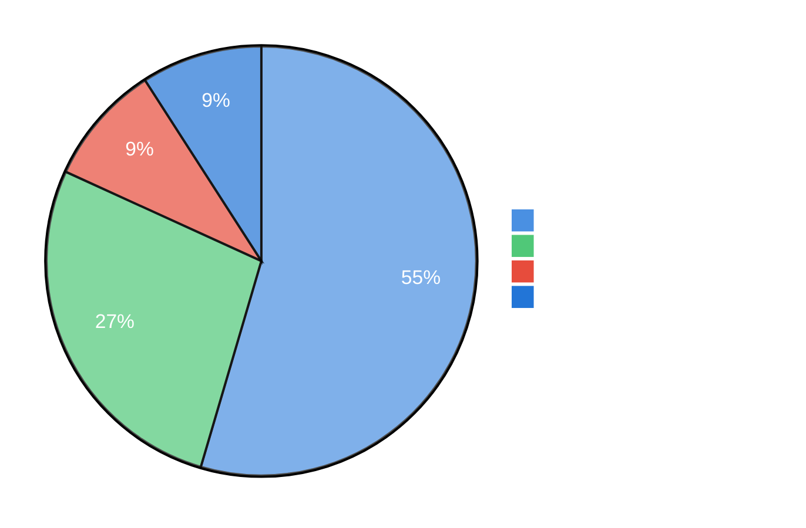
```mermaid
%%{init: {'theme':'base', 'themeVariables': { 'primaryColor':'#4a90e2','primaryTextColor':'#fff','primaryBorderColor':'#2e5c8a','lineColor':'#f39c12','secondaryColor':'#50c878','tertiaryColor':'#e74c3c'}}}%%
pie title "Покрытие тестами (Coverage)"
    "100% (6 модулей)" : 6
    "90-99% (3 модуля)" : 3
    "40% (1 модуль - main)" : 1
    "Uncovered" : 1
```

---

### Метрики качества кода

```mermaid
graph LR
    subgraph "Code Quality Metrics"
        Coverage["📊 Coverage<br/>━━━━━━━━<br/>87.59%<br/>✅ Target >80%"]
        
        Tests["🧪 Tests<br/>━━━━━━━━<br/>149 passed<br/>✅ 100% success"]
        
        Ruff["🎨 Ruff<br/>━━━━━━━━<br/>0 errors<br/>✅ Clean"]
        
        Mypy["📘 Mypy<br/>━━━━━━━━<br/>0 errors<br/>✅ Strict mode"]
        
        Modules["📦 Modules<br/>━━━━━━━━<br/>11 files<br/>100% typed"]
    end
    
    style Coverage fill:#50c878,stroke:#2e7d4e,color:#fff,stroke-width:3px
    style Tests fill:#50c878,stroke:#2e7d4e,color:#fff,stroke-width:3px
    style Ruff fill:#50c878,stroke:#2e7d4e,color:#fff,stroke-width:3px
    style Mypy fill:#50c878,stroke:#2e7d4e,color:#fff,stroke-width:3px
    style Modules fill:#4a90e2,stroke:#2e5c8a,color:#fff,stroke-width:2px
```

---

## Развертывание и окружения

### Конфигурация окружений

```mermaid
graph TB
    subgraph "Development"
        DevEnv["🛠️ .env.development"]
        DevConfig["• LOG_LEVEL=DEBUG<br/>• LOG_TO_FILE=true<br/>• LOG_COLORFUL=true<br/>• MAX_HISTORY=5"]
    end
    
    subgraph "Testing"
        TestEnv["🧪 .env.test"]
        TestConfig["• LOG_LEVEL=ERROR<br/>• LOG_TO_FILE=false<br/>• MAX_HISTORY=2<br/>• Mocked API"]
    end
    
    subgraph "Production"
        ProdEnv["🚀 .env.production"]
        ProdConfig["• LOG_LEVEL=INFO<br/>• LOG_TO_FILE=true<br/>• LOG_COLORFUL=false<br/>• MAX_HISTORY=10"]
    end
    
    App["Приложение"]
    
    DevEnv --> DevConfig
    TestEnv --> TestConfig
    ProdEnv --> ProdConfig
    
    DevConfig --> App
    TestConfig --> App
    ProdConfig --> App
    
    style DevEnv fill:#f39c12,stroke:#c87f0a,color:#fff,stroke-width:2px
    style TestEnv fill:#e74c3c,stroke:#b03a2e,color:#fff,stroke-width:2px
    style ProdEnv fill:#50c878,stroke:#2e7d4e,color:#fff,stroke-width:2px
    style App fill:#4a90e2,stroke:#2e5c8a,color:#fff,stroke-width:3px
```

---

## Система команд

### Граф обработки команд

```mermaid
graph TD
    Input["Ввод пользователя"]
    
    Parse{"Начинается<br/>с '/'?"}
    
    Command["Команда"]
    Message["Обычное сообщение"]
    
    Help["/help<br/>━━━━━━━━<br/>Показать справку"]
    History["/history<br/>━━━━━━━━<br/>Показать историю"]
    Stats["/stats<br/>━━━━━━━━<br/>Показать статистику"]
    Role["/role<br/>━━━━━━━━<br/>Информация о роли"]
    Clear["/clear<br/>━━━━━━━━<br/>Очистить историю"]
    Exit["/exit<br/>━━━━━━━━<br/>Выход"]
    Unknown["Неизвестная команда"]
    
    LLM["Обработка через LLM"]
    
    Display["Вывод результата"]
    
    Input --> Parse
    
    Parse -->|Да| Command
    Parse -->|Нет| Message
    
    Command --> Help
    Command --> History
    Command --> Stats
    Command --> Role
    Command --> Clear
    Command --> Exit
    Command --> Unknown
    
    Message --> LLM
    
    Help --> Display
    History --> Display
    Stats --> Display
    Role --> Display
    Clear --> Display
    Unknown --> Display
    
    LLM --> Display
    
    Exit --> End["Завершение"]
    
    Display --> Input
    
    style Input fill:#4a90e2,stroke:#2e5c8a,color:#fff,stroke-width:3px
    style Parse fill:#95a5a6,stroke:#7f8c8d,color:#fff,stroke-width:2px
    style Help fill:#50c878,stroke:#2e7d4e,color:#fff,stroke-width:2px
    style History fill:#50c878,stroke:#2e7d4e,color:#fff,stroke-width:2px
    style Stats fill:#50c878,stroke:#2e7d4e,color:#fff,stroke-width:2px
    style Role fill:#50c878,stroke:#2e7d4e,color:#fff,stroke-width:2px
    style Clear fill:#f39c12,stroke:#c87f0a,color:#fff,stroke-width:2px
    style Exit fill:#e74c3c,stroke:#b03a2e,color:#fff,stroke-width:2px
    style LLM fill:#9b59b6,stroke:#7d3c98,color:#fff,stroke-width:2px
    style End fill:#e74c3c,stroke:#b03a2e,color:#fff,stroke-width:3px
```

---

## 📚 Использование диаграмм

Эти диаграммы помогут вам:

1. **Быстро понять архитектуру** — общая картина за минуты
2. **Объяснить проект новичкам** — визуальный онбординг
3. **Принимать архитектурные решения** — видеть зависимости
4. **Отлаживать проблемы** — понять поток данных
5. **Планировать изменения** — оценить влияние на систему

---

**⏱️ Время изучения:** 30-45 минут для всех диаграмм  
**🎯 Вернуться:** [Главная страница гайдов](README.md)

